# UOS AI Assistant|uos-ai-assistant|

## Overview
UOS AI Assistant is a comprehensive assistant with main features including writing Q&A, text-to-image generation, natural language control, document summarization, etc. It aims to provide users with full-range AI assistance. The main capabilities are introduced as follows:

**Writing Q&A**

UOS AI Assistant can generate various forms of content based on user questions or instructions, including text, images, etc., and provide detailed answers.  
In office environments, you can use this feature to quickly generate meeting minutes, draft reports, etc. For learning purposes, you can query materials and obtain detailed explanations of knowledge points.

**Natural Language Interaction (System Control)**

This feature allows users to interact with the assistant through natural language to control the computer system or applications, such as opening apps, adjusting system parameters, creating schedules, etc.  
Simply give instructions like "Remind me to attend the meeting at 3 PM," and the assistant will automatically set the schedule. You can also complete system settings with a single sentence, such as "Set screen brightness to 20%" or "Change wallpaper." Additionally, you can open apps with a single sentence, such as "Open WPS," without searching through the app list.

**Personal Knowledge Base**

The personal knowledge base allows users to add their own materials to the [Personal Knowledge Assistant]. After adding, the AI can answer questions or write based on the user's knowledge.

**AI FollowAlong**

You can activate the AI FollowAlong on any screen of the system (including most third-party applications) by selecting words or paragraphs. The AI FollowAlong offers features like AI search, AI explanation, AI summarization, AI translation, as well as continuation, expansion, error correction, and polishing.

## Quick Start
### Understanding the Interface

UOS AI Assistant supports two interface modes, which can be switched based on different usage scenarios. To switch modes, go to the [More] submenu in the top toolbar and select the [Mode] option to choose the desired mode.

**Window Mode**

The interface is horizontal and can be moved or resized freely, suitable for an immersive experience.

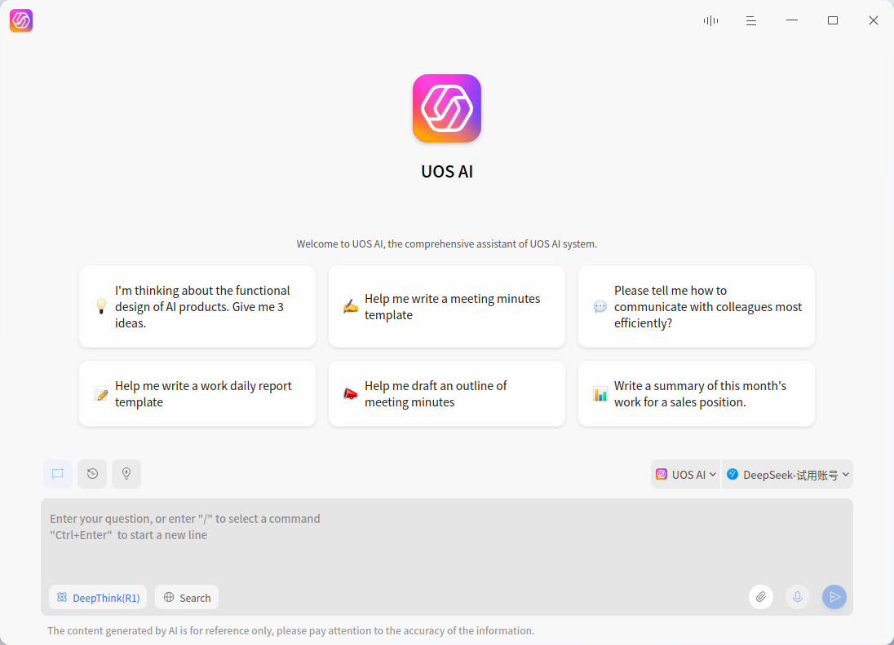

**Sidebar Mode**

The interface is vertical, fixed on the left side of the screen, and cannot be moved, but its width can be adjusted. This mode is suitable for scenarios where the assistant is used alongside other applications to provide AI assistance.

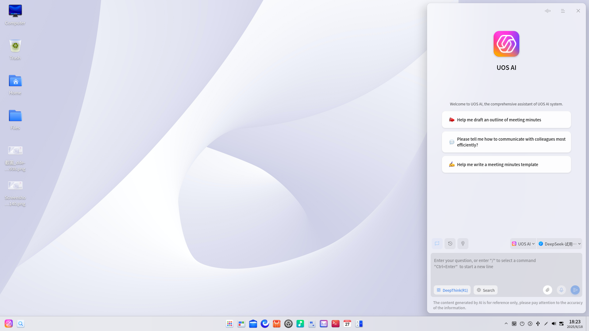

### Text Chat Mode

**Voice Input**

The voice input feature allows users to communicate with the AI Assistant by speaking, eliminating the need for manual typing. The steps are as follows:  
1. Activate voice input: Click the microphone icon next to the input box to activate voice input mode.  
2. Start speaking: After activating voice input, you can start speaking. UOS AI Assistant will listen and transcribe your voice input in real time.  
3. Send text: After completing the input, click the send button or press Enter to send the text to the AI Assistant.

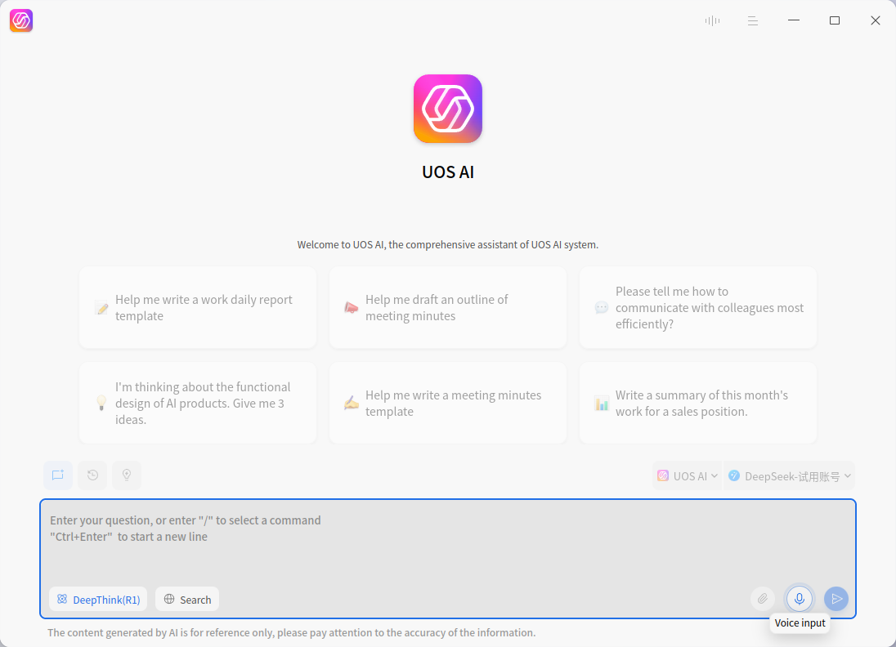

**Text Input**

Text input is the traditional method of text communication. Users can type questions, system operation commands, or writing prompts in the input box.  
1. Click the input box: Position the cursor in the input box.  
2. Type text: Enter the question or command you want to ask or execute.  
3. Send text: After completing the input, click the send button or press Enter to send the text to the AI Assistant.

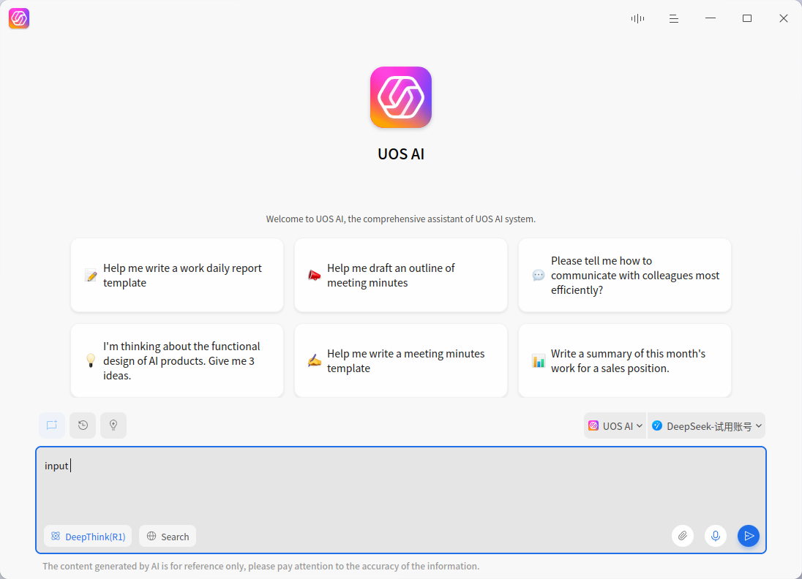

**Input Box Features**

1. Multilingual support: The text input of UOS AI Assistant supports Chinese, English, and other languages (depending on the supported languages of the connected large model), but voice input only supports Chinese and English.  
2. Real-time feedback: During voice input, the input box displays dynamic icons to inform the user that the assistant is listening to the command.  
3. File support: You can drag files into the input box and send them to the assistant. The assistant can summarize the file content or answer questions based on the file content.  
4. Line break input: Press Ctrl+Enter to add a line break.  
5. The chat area is where UOS AI Assistant displays conversation history and interaction feedback. It can present text and image replies and integrates enhanced features like read-aloud and copy. It also supports clearing the current chat history.  
6. If you are not satisfied with the answer to a question, you can click [Regenerate] to generate a new answer. You can also click the answer toggle button to compare each generated answer.

### Voice Conversation Mode

The voice conversation feature of UOS AI Assistant allows users to directly communicate with the assistant via voice, and the AI Assistant will respond with voice as well. This feature simulates real human-to-human conversation scenarios, offering natural and friendly interaction.

Users can ask questions to UOS AI and continue with follow-up questions via voice, making the questioning process as natural as discussing with a person. Users can also treat UOS AI Assistant as a companion for storytelling, chatting, or seeking advice.

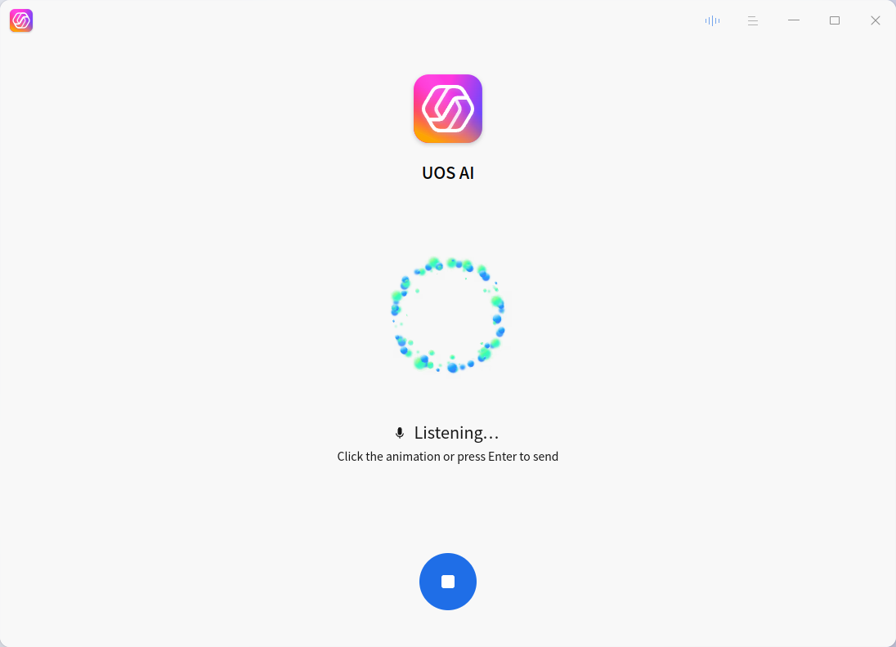

### Getting Started

Find the UOS AI application icon in the taskbar and click to open the app.  
Upon first entry, a pop-up will prompt you to claim a free account. Click the claim button to get a free account.  
Note: The free account giveaway may end, and the specific activity duration is subject to the in-app display. If you do not use the free account, you can also configure your own large model account to use UOS AI Assistant.  
After completing the account claim, enter the app, select UOS AI Assistant, and start chatting and answering questions (UOS AI Assistant is selected by default).

## Smart Agents

### UOS AI Assistant
UOS AI Assistant is a comprehensive assistant capable of completing various tasks, such as:  
1. AI Q&A: Directly answers common sense questions. When the official free Deepseek model is selected, it can also perform online searches to answer questions with timeliness or topics not covered by the large model's knowledge.  
2. AI Writing: Completes writing tasks based on your prompts, such as "Write a monthly work summary based on all my weekly reports this month (provided via files)."  
3. System Control: Adjust screen brightness to 40%, open the WPS app, create schedules.  
4. AI Image Generation: Generates images based on your needs, such as "Draw a picture: Sunset and a lone bird flying together."  
Note: System control and AI image generation rely on specific models and do not support local models.

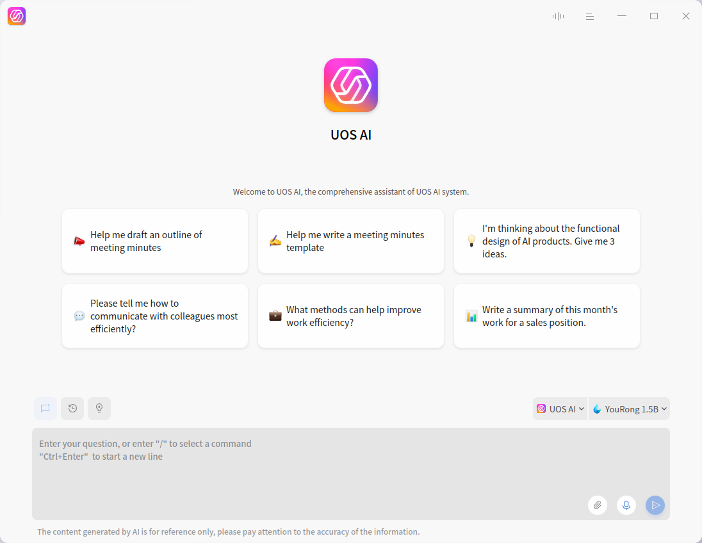

### Deepin Play Assistant

This assistant includes the user manual and solutions for deepin systems and related applications. It can help you answer questions about deepin systems and related applications.  
It will be your 7x24h customer service. Any questions about deepin systems and applications can be consulted with it.

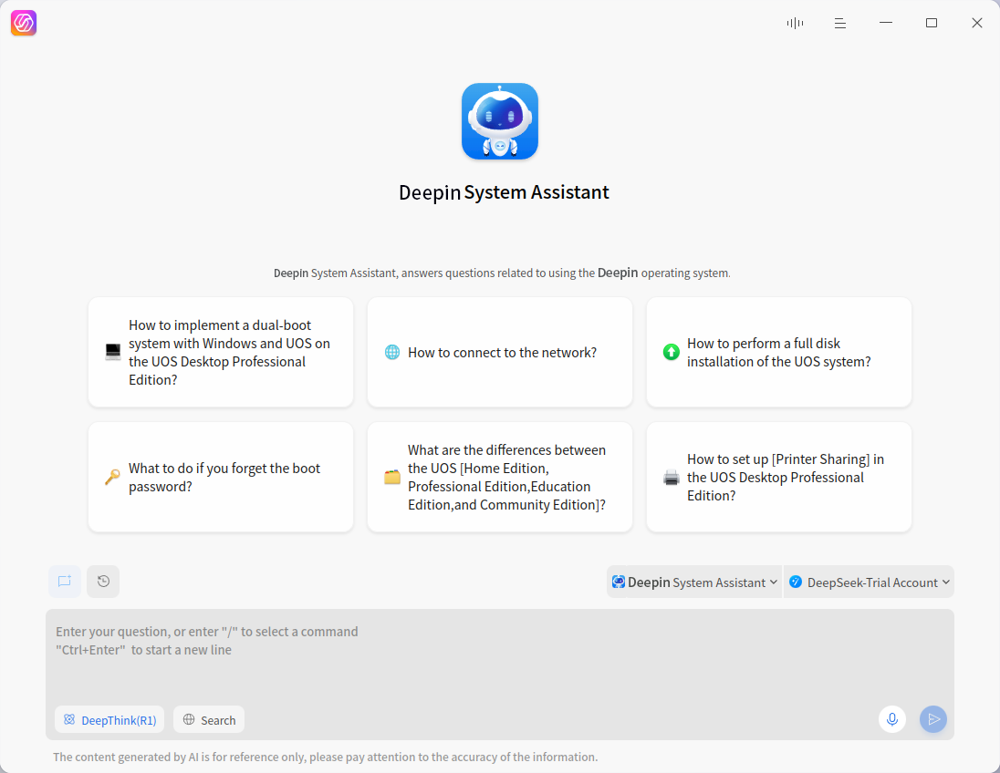

### Personal Knowledge Assistant

The Personal Knowledge Assistant is a knowledge management and application solution tailored for individuals. This agent allows you to add your own knowledge to the AI's knowledge base. When answering questions or writing, the AI will prioritize referencing your knowledge base. This solves the problem of the AI not knowing your private knowledge, making the AI-generated content more aligned with your work environment.  
Select the Personal Knowledge Assistant from the agent list to start using it.  
Note: Before using the Personal Knowledge Assistant, you need to add your documents to the knowledge base. After successful addition, you can ask questions about the knowledge base in the [Personal Knowledge Assistant] agent, and the AI-generated answers will be based on your knowledge base.  
For specific addition methods, refer to the [Settings] - [Knowledge Base Settings] section below.

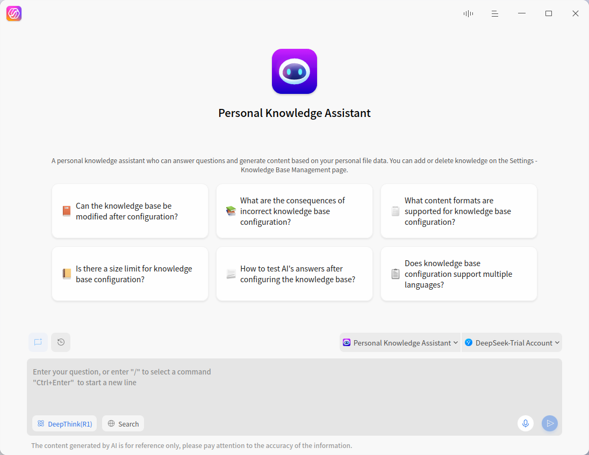

## Settings
### Model Access

UOS AI Assistant supports three types of models. The usage methods are as follows:

**Online Models**

After launching the app, claim a free account. Once claimed, you can start the trial.  
If you miss the free account pop-up during the initial launch, you can claim it in the settings.  
In addition to claiming a free account, you can also configure your own online models.

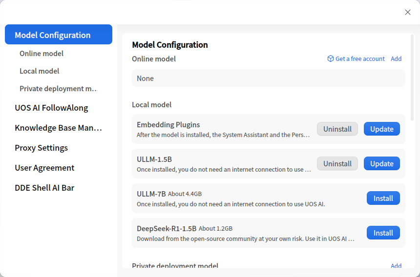

You can also add your own AI model accounts to adapt to various specific usage scenarios. Click the [Add] button in the [Online Models] section to bring up the [Add Model] pop-up. You can select the desired model, fill in parameters like API Key, and start using the model.

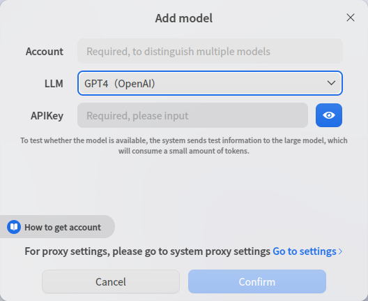

Currently, the officially adapted models include Baidu Qianfan, iFlytek Spark, 360 ZhiNao, and Zhipu ChatGLM.

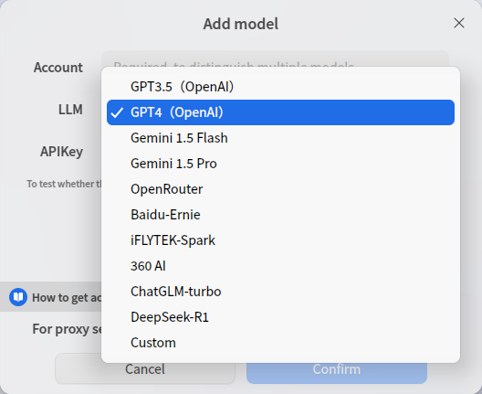

If you need to access other models, you can also do so via custom model access. Custom models support all OpenAI-format API interfaces.

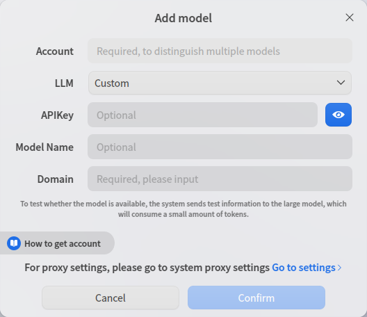

**Local Models**

Open the settings, install the [Vectorization Model Plugin] first, then install the [Deepseek] local model. After successful installation, select the Yourong large model in the model list.  
Note: Before installing and using the Deepseek model, you must install the [Vectorization Model Plugin]; otherwise, the local model cannot be downloaded or used.

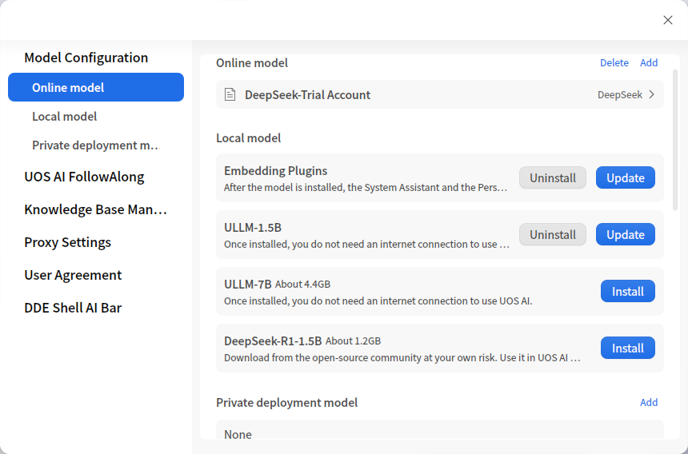

**Privately Deployed Models**

Open the settings, and in the [Privately Deployed Models] section, you can access privately deployed models, allowing UOS AI to use your own models to answer questions or write.  
Note: Currently, only OpenAI-format APIs are supported.

### Knowledge Base Management

Before using the knowledge base, you need to create your knowledge base. In the [Settings] - [Knowledge Base Management] module, you can create and manage your knowledge base.  
Click the [Add] button to add files to the knowledge base. After successful addition, you can ask questions about the knowledge base in the [Personal Knowledge Assistant] agent, and the AI-generated answers will be based on your knowledge base.  
Click the [Delete] button to delete added documents one by one.

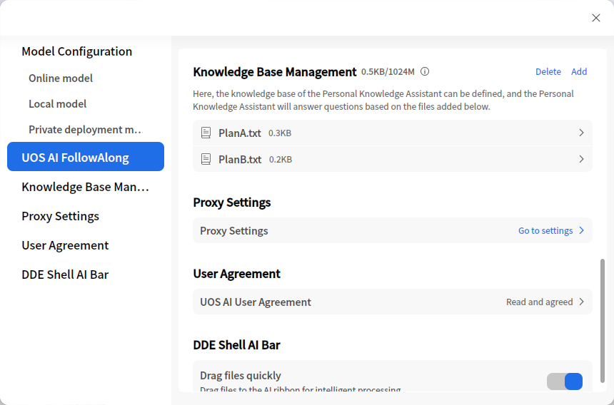

### General Settings

In the settings, in addition to configuring models and knowledge base management, you can also:  
1. Enable or disable the Companion feature. When disabled, the Companion icon will not appear when selecting text.  
2. Set the app's proxy to facilitate access to all models.  
3. View the usage agreement.

## Plugins
### AI FollowAlong

**Activation Method**

On any system interface (including most third-party applications), select text, and the UOS AI icon  will appear. Hover the mouse over the icon for about 0.5 seconds, and the Companion toolbar will appear. Click anywhere outside the toolbar or press Esc to close the Companion toolbar.

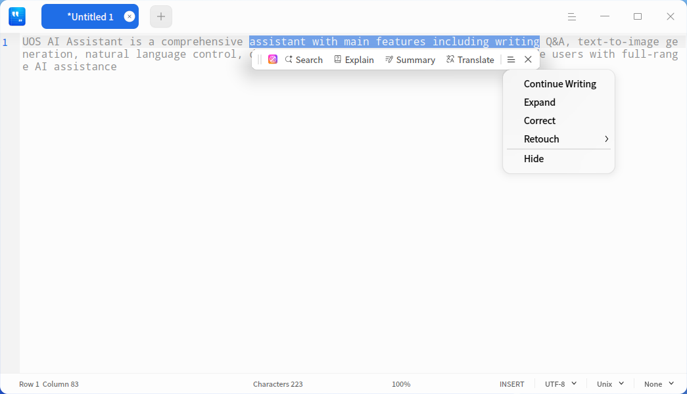

**Toolbar Functions**

| Function Name | Explanation                                                  |
| ------------- | ------------------------------------------------------------ |
| Icon          | Click to open the UOS AI Assistant panel.                    |
| Search        | Opens AI search in the browser to provide in-depth explanations of selected words. |
| Explain | Provides clear and easy-to-understand explanations of selected words. |
| Summary | Concise summarization of selected words.                     |
| Translate  | Translates selected text into Chinese/English.               |
| Continue Writing | Continues writing content that aligns with the original meaning of the selected words. |
| Expand     | Expands on the selected words, adding details or descriptions to enrich the content. |
| Correct | Corrects typos and inappropriate wording in the selected words. |
| Retouch | Adjusts and polishes the style and wording of the selected words based on the chosen polishing style. |
| Hide         | Hides the Companion feature. It will no longer appear when selecting text, but can be re-enabled in UOS AI settings or activated using the shortcut Super+Space. |

**Companion Generation Panel**

Click any Companion function to open the quick generation panel and generate results in real time. At the top of the panel, you can switch to other Companion functions.

If satisfied with the generated results, click **Paste to Text** in any input box to paste the results into the input box, or click **Copy** to copy the results to the clipboard.

If unsatisfied with the generated results, click **Regenerate** to generate new content.

To further adjust the generated results, click **Continue Conversation** or click  to bring the current conversation into the UOS AI Assistant dialog box and send new instructions for adjustments.

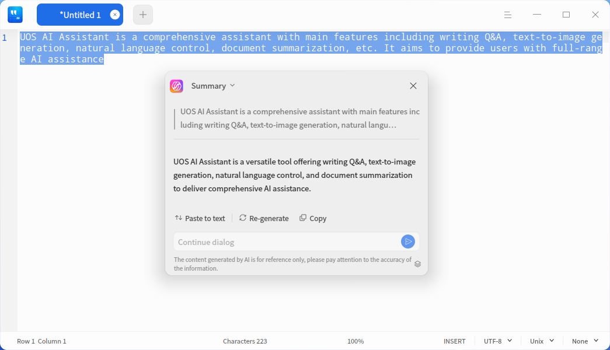

### AI Writing

**Activation Method**

In most system input boxes, while in input mode, use the shortcut **Super+Space** to activate AI Writing. The panel can be closed by clicking the x or pressing Esc.

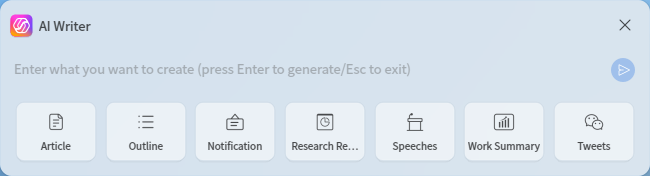

**Functions**

AI Writing provides 7 prompt templates for writing scenarios, including articles, outlines, and notices.

Select any template, replace the [blue keywords] in the template, and press Enter or click  to send.

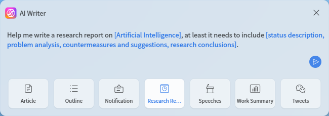

After the large model generates content based on the prompts:

If satisfied with the generated results, click **Paste to Text** in any input box to paste the results into the input box, or click **Copy** to copy the results to the clipboard.

If unsatisfied with the generated results, click **Regenerate** to generate new content.

To further adjust the generated results, click the top input box "Modify the generated content, change the tone..." and send new instructions for adjustments.

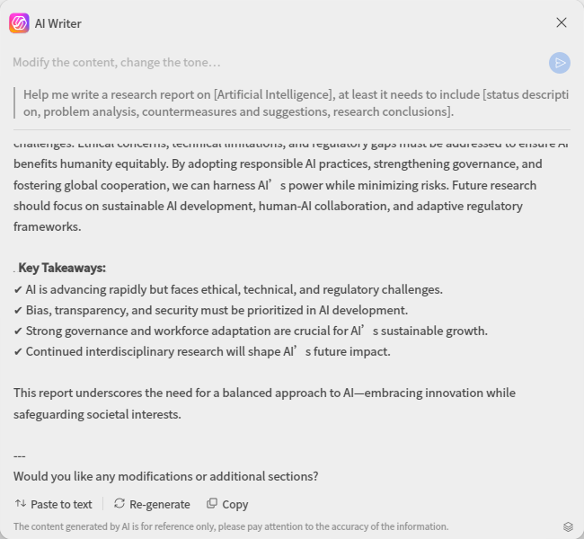

## Version Differences Explanation

Due to differences in device performance, system versions, and other factors, features such as local models, personal knowledge base, and online models may not be supported on certain versions or devices.  
It is recommended to use the latest system and update the UOS AI application to the newest version. Additionally, use devices with better performance to experience the full range of AI capabilities.
