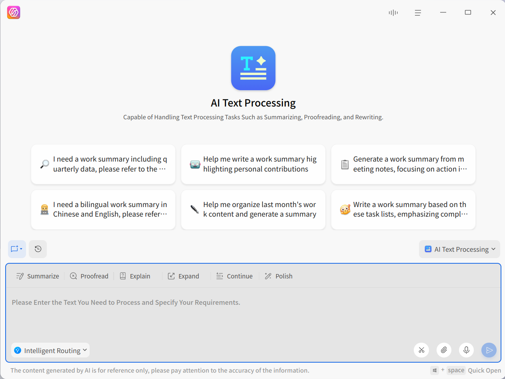
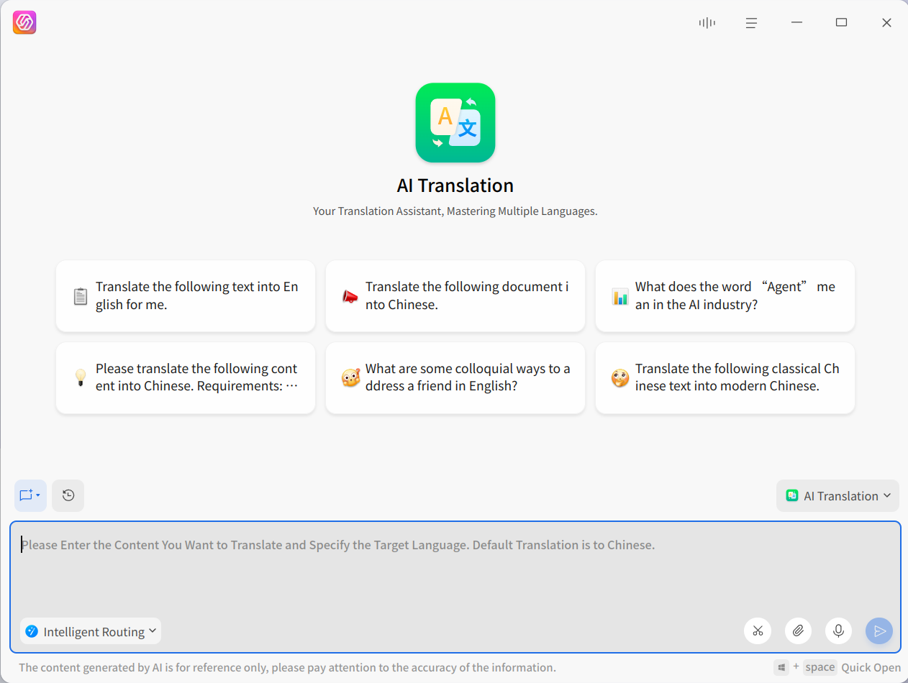
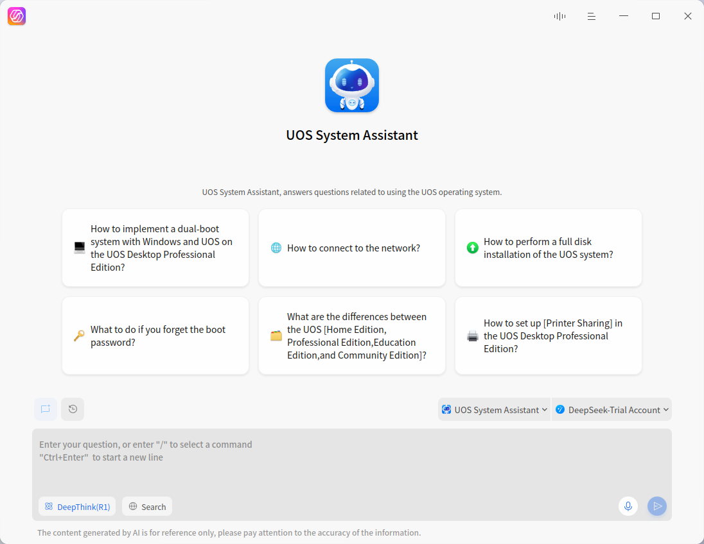
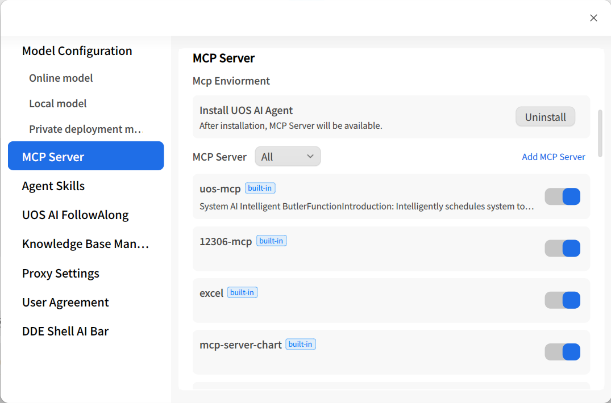
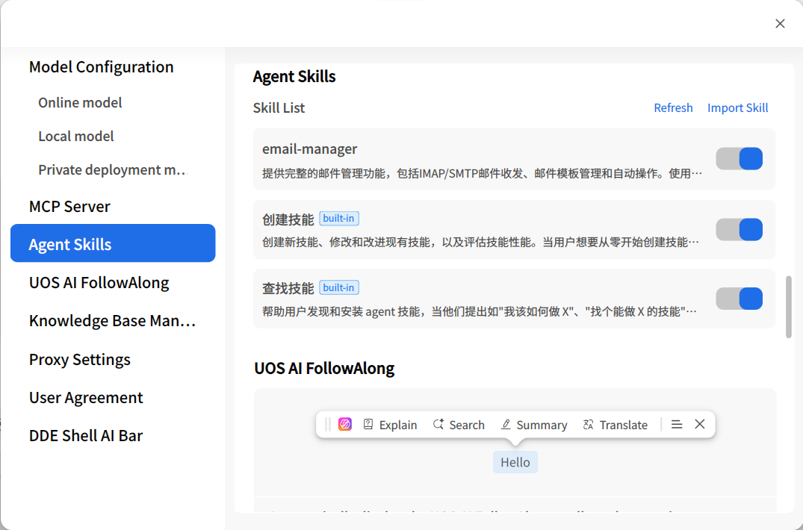

# UOS AI Assistant|uos-ai-assistant|

## Overview
UOS AI Assistant is a comprehensive assistant with main features including writing Q&A, text-to-image generation, natural language control, document summarization, etc. It aims to provide users with full-range AI assistance. The main capabilities are introduced as follows:

**Writing Q&A**

UOS AI Assistant can generate various forms of content based on user questions or instructions, including text, images, etc., and provide detailed answers.  
In office environments, you can use this feature to quickly generate meeting minutes, draft reports, etc. For learning purposes, you can query materials and obtain detailed explanations of knowledge points.

**Natural Language Interaction (System Control)**

This feature allows users to interact with the assistant through natural language to control the computer system or applications, such as opening apps, adjusting system parameters, creating schedules, etc.  
Simply give instructions like "Remind me to attend the meeting at 3 PM," and the assistant will automatically set the schedule. You can also complete system settings with a single sentence, such as "Set screen brightness to 20%" or "Change wallpaper." Additionally, you can open apps with a single sentence, such as "Open WPS," without searching through the app list.

**Personal Knowledge Base**

The personal knowledge base allows users to add their own materials to the knowledge base. After enabling the knowledge base feature, the AI can answer questions or write based on your exclusive knowledge, making the generated content more aligned with your actual work environment.

**AI FollowAlong**

You can activate the AI FollowAlong on any screen of the system (including most third-party applications) by selecting words or paragraphs. The AI FollowAlong offers features like AI search, AI explanation, AI summarization, AI translation, as well as continuation, expansion, error correction, and polishing.

## Quick Start
### Understanding the Interface

UOS AI Assistant supports two interface modes, which can be switched based on different usage scenarios. To switch modes, go to the **More** submenu in the top toolbar and select the **Mode** option to choose the desired mode. Use **Super + Space** to quickly evoke window mode.

**Window Mode**

The interface is horizontal and can be moved or resized freely, suitable for an immersive experience.

**Sidebar Mode**

The interface is vertical, fixed on the left side of the screen, and cannot be moved, but its width can be adjusted. This mode is suitable for scenarios where the assistant is used alongside other applications to provide AI assistance.

### Text Chat Mode

**Voice Input**

The voice input feature allows users to communicate with the AI Assistant by speaking, eliminating the need for manual typing. The steps are as follows:  
1. Activate voice input: Click the microphone icon next to the input box to activate voice input mode.  
2. Start speaking: After activating voice input, you can start speaking. UOS AI Assistant will listen and transcribe your voice input in real time.  
3. Send text: After completing the input, click the send button or press **Enter** to send the text to the AI Assistant.

**Text Input**

Text input is the traditional method of text communication. Users can type questions, system operation commands, or writing prompts in the input box.  
1. Click the input box: Position the cursor in the input box.  
2. Type text: Enter the question or command you want to ask or execute.  
3. Send text: After completing the input, click the send button or press **Enter** to send the text to the AI Assistant.

**Input Box Features**

1. Multilingual support: The text input of UOS AI Assistant supports Chinese, English, and other languages (depending on the supported languages of the connected large model), but voice input only supports Chinese and English.  
2. Real-time feedback: During voice input, the input box displays dynamic icons to inform the user that the assistant is listening to the command.  
3. Support for files and images: You can drag, paste, or upload up to 3 files or images (supporting documents, images, Markdown, common code formats, etc.) into the input box to send to the assistant. The assistant can extract the content for summarization or Q&A.
4. Screenshot Q&A: Click the **Screenshot Q&A** entry or use the shortcut **Ctrl + Alt + Q** to directly call the system screenshot and send it to the assistant for Q&A.
5. Line break input: Press **Ctrl + Enter** to add a line break.
6. Privacy dialog: Click the drop-down menu next to the **New Chat** icon to choose to create a **Normal Chat** or a **Privacy Chat**. After entering a privacy chat, chat records will not be saved, and the content will be completely deleted when you leave the interface.
7. History: Click the **History** icon on the chat interface to expand the history panel from bottom to top to view history. Hover over a session and click the **Delete** icon to clear it. Click the **Clear History** button to clear all history.
8. The chat area is where UOS AI Assistant displays conversation history and interaction feedback. It can present text and image replies and integrates enhanced features like read-aloud and copy. It also supports clearing the current chat history.
9. Message secondary editing: Below each message you send, **Copy** and **Re-edit** features are provided. Click **Re-edit** to bring the text and files contained in that message back into the input box to easily adjust instructions.
10. If you are not satisfied with the answer to a question, you can click **Regenerate** to generate a new answer. You can also click the answer toggle button to compare each generated answer.

### Voice Conversation Mode

The voice conversation feature of UOS AI Assistant allows users to directly communicate with the assistant via voice, and the AI Assistant will respond with voice as well. This feature simulates real human-to-human conversation scenarios, offering natural and friendly interaction.

Users can ask questions to UOS AI and continue with follow-up questions via voice, making the questioning process as natural as discussing with a person. Users can also treat UOS AI Assistant as a companion for storytelling, chatting, or seeking advice.

### Getting Started

Find the UOS AI application icon in the taskbar and click to open the app.  
Upon first entry, a pop-up will prompt you to claim a free account. Click the claim button to get a free account.  
Note: The free account giveaway may end, and the specific activity duration is subject to the in-app display. If you do not use the free account, you can also configure your own large model account to use UOS AI Assistant.  
After completing the account claim, enter the app, select UOS AI Assistant, and start chatting and answering questions (UOS AI Assistant is selected by default).

## Smart Agents

### UOS AI Assistant
UOS AI Assistant is a comprehensive assistant capable of completing various tasks, such as:  
1. AI Q&A: Directly answers common sense questions. When the official free "Smart Dispatch" model is selected, it can also perform online searches to answer questions with timeliness or topics not covered by the large model's knowledge.  
2. Commands: After turning on the **Commands** switch, it supports system control, opening/closing apps, sending emails, creating schedules, multimedia control, etc., for example: adjust screen brightness to 40%, open the WPS app, create a schedule.
3. Knowledge Base: After turning on the **Knowledge Base** switch, the assistant will prioritize answering questions based on the content in your personal knowledge base.
4. MCP & Skills: Turn on the **MCP & Skills** switch to use MCP services and Skills. With just a one-sentence instruction (e.g., "Change the system to dark mode"), it can automatically call relevant system settings, file processing, and other automation tools to complete complex tasks. The Skills module has built-in features to create and find skills. You can freely search and create the skills you need (e.g., "Help me create a weekly report skill"), achieving multi-step complex work with one sentence.
5. AI Image Generation: Generates images based on your needs, such as "Draw a picture: Sunset and a lone bird flying together."  
Note: System control and AI image generation rely on specific models and do not support local models.

### AI Writing

The AI Writing smart agent is specially designed for users who need to write official documents, reports, or long articles. It allows you to generate professional documents based on local reference materials and structured outlines, while supporting the use of edge-side models to ensure the security and privacy of data.

- **Upload Materials and Outline**: At the top of the dialog box, click **Local Materials** to upload up to 10 reference files; click **Outline File** to upload 1 outline file. The system will automatically parse the outline, and you can also add, delete, and drag to sort the chapters of the outline on the interface.
- **Generate based on Outline**: After confirming the outline is correct, click **Generate Content Based on Outline**, and the AI will automatically collect materials and generate the main text.
- **Built-in Writing Editor**: After the content is generated, click to enter the built-in writing editor page. Within the editor, you can further format the text, such as bolding, modifying heading levels, and setting lists.
- **Export Document**: After editing is complete, click **Save As** in the toolbar to save the document as a Word, PDF, or Markdown format to local storage.

### AI Text Processing

The AI Text Processing smart agent is specifically designed to handle various text tasks and is capable of performing text processing work such as summarizing, correcting errors, and rewriting.

It provides processing capabilities like translation, summarization, and polishing. Click the corresponding function tag to highlight it; at this time, the content in the input box will not be cleared. If no tag is selected, the system will randomly provide you with question prompts.

Type the content to be processed and the requirements in the input box, and press the **Enter** key to send it to the assistant for processing.

### AI Translation

The AI Translation smart agent is proficient in multi-language translation.

Type the content you want to translate in the input box, specify the target language, and press the **Enter** key to send it to the assistant for processing. The default translation is into Chinese.

### Play Assistant

This assistant includes the user manual and solutions for UOS systems and related applications. It can help you answer questions about UOS systems and related applications.  
It will be your 7x24h customer service. Any questions about UOS systems and applications can be consulted with it.

## Settings
### Model Access

UOS AI Assistant supports three types of models. The usage methods are as follows:

**Online Models**

After launching the app, claim a free account. Once claimed, you can start the trial.  
If you miss the free account pop-up during the initial launch, you can claim it in the settings.  
In addition to claiming a free account, you can also configure your own online models.

You can also add your own AI model accounts to adapt to various specific usage scenarios. Click the **Add** button in the [Online Models] section to bring up the [Add Model] pop-up. You can select the desired model, fill in parameters like API Key, and start using the model.

Currently, the officially adapted models include Baidu Qianfan, iFlytek Spark, 360 ZhiNao, and Zhipu ChatGLM.

If you need to access other models, you can also do so via custom model access. Custom models support all OpenAI-format API interfaces.

**Local Models**

Open the settings, install the **Vectorization Model Plugin** first, then install the **Deepseek** local model. After successful installation, select the Yourong large model in the model list.  
Note: Before installing and using the Deepseek model, you must install the **Vectorization Model Plugin**; otherwise, the local model cannot be downloaded or used.

**Privately Deployed Models**

Open the settings, and in the **Privately Deployed Models** section, you can access privately deployed models, allowing UOS AI to use your own models to answer questions or write.  
Note: Currently, only OpenAI-format APIs are supported.

### Knowledge Base Management

Before using the knowledge base, you need to create your knowledge base, operating in the **Knowledge Base Management** module under [Settings].  
Click the **Add** button to add files to the knowledge base, supporting common documents, Markdown, images, code, and other formats. In addition to adding them in the settings, you can also right-click a file in the system file manager or on the desktop and select **Add to AI Knowledge Base**, or click **Add to AI Knowledge Base** in the FollowAlong toolbar to quickly enter content.  
After successfully adding, you can turn on the **Knowledge Base** switch at the top of the UOS AI Assistant chat box, and the AI will answer based on your knowledge base content.  
Click the **Delete** button to delete added documents one by one.

### MCP Server

If you want to use more MCP Server, you can manage and configure MCP tools in the **MCP Server** module under [Settings]:

1. **Install Environment**: For first-time use, you need to click to install the UOS AI Agent environment.
2. **Manage Server**: The list displays built-in system MCP Servers, third-party selected MCP servers, and user-customized added servers. You can freely enable, disable, edit, or delete custom servers.
3. **Add Server**: Click **Add MCP Server**, paste valid JSON configuration code into the input box to integrate more automated control tools.

>  Attention: Enabling third-party MCP server functions carries certain risks. Using built-in tools to automatically download dependencies may incur data traffic charges. Please be aware of the risks and operate with caution.

### Agent Skills

You can import and manage skills in the Agent Skills module.

Click **Import Skill** to import a skill file, supporting the import of .zip and .skill compressed files.

In the Skill list, you can enable and disable skills, or delete custom skills.

### IM Integration

UOS AI supports integration with mainstream IM tools such as **Feishu**, **QQ**, and **DingTalk**, enabling cross-terminal synergy between mobile and PC.

In the **IM Integration** module, click **Enable Message Forwarding Service** and select the IM tools you wish to configure to enable this feature. Please refer to the officially released configuration tutorials for detailed setup methods.

### General Settings

In the settings, in addition to configuring models and knowledge base management, you can also:  
1. Enable or disable the Companion feature. When disabled, the Companion icon will not appear when selecting text.  
2. Set the app's proxy to facilitate access to all models.  
3. View the usage agreement.

## Plugins
### AI FollowAlong

**Activation Method**

On any system interface (including most third-party applications), select text, and the UOS AI icon  will appear. Hover the mouse over the icon for about 0.5 seconds, and the Companion toolbar will appear. 

You can also directly use the shortcut **Super + R** to wake it up.

Click anywhere outside the toolbar or press **Esc** to close the Companion toolbar.

**Toolbar Functions**

| Function Name            | Explanation                                                  |
| ------------------------ | ------------------------------------------------------------ |
| Icon                     | Click to open the UOS AI Assistant panel.                    |
| Explain                  | Provides clear and easy-to-understand explanations of selected words. |
| Search                   | Opens AI search in the browser to provide in-depth explanations of selected words. |
| Summary                  | Concise summarization of selected words.                     |
| Translate                | Translates selected text into Chinese/English.               |
| Ask AI                   | Quickly ask questions regarding the selected content.        |
| Add to AI Knowledge Base | Quickly save the selected content to your personal knowledge base for future reference. |
| Continue Writing         | Continues writing content that aligns with the original meaning of the selected words. |
| Expand                   | Expands on the selected words, adding details or descriptions to enrich the content. |
| Correct                  | Corrects typos and inappropriate wording in the selected words. |
| Retouch                  | Adjusts and polishes the style and wording of the selected words based on the chosen polishing style. |
| Hide                     | Hides the Companion feature. It will no longer appear when selecting text, but can be re-enabled in UOS AI settings or activated using the shortcut **Super + R**. |

**Companion Generation Panel**

Click any Companion function to open the quick generation panel and generate results in real time. At the top of the panel, you can switch to other Companion functions.

If satisfied with the generated results, click **Paste to Text** in any input box to paste the results into the input box, or click **Copy** to copy the results to the clipboard.

If unsatisfied with the generated results, click **Regenerate** to generate new content.

To further adjust the generated results, click **Continue Conversation** or click  to bring the current conversation into the UOS AI Assistant dialog box and send new instructions for adjustments.

### AI Writing

**Activation Method**

In most system input boxes, while in input mode, use the shortcut **Super + Space** to activate AI Writing. The panel can be closed by clicking the x or pressing **Esc**.

**Functions**

AI Writing provides 7 prompt templates for writing scenarios, including articles, outlines, and notices.

Select any template, replace the [blue keywords] in the template, and press **Enter** or click  to send.

After the large model generates content based on the prompts:

If satisfied with the generated results, click **Paste to Text** in any input box to paste the results into the input box, or click **Copy** to copy the results to the clipboard.

If unsatisfied with the generated results, click **Regenerate** to generate new content.

To further adjust the generated results, click the top input box "Modify the generated content, change the tone..." and send new instructions for adjustments.

## Version Differences Explanation

Due to differences in device performance, system versions, and other factors, features such as local models, personal knowledge base, and online models may not be supported on certain versions or devices.  
It is recommended to use the latest system and update the UOS AI application to the newest version. Additionally, use devices with better performance to experience the full range of AI capabilities.