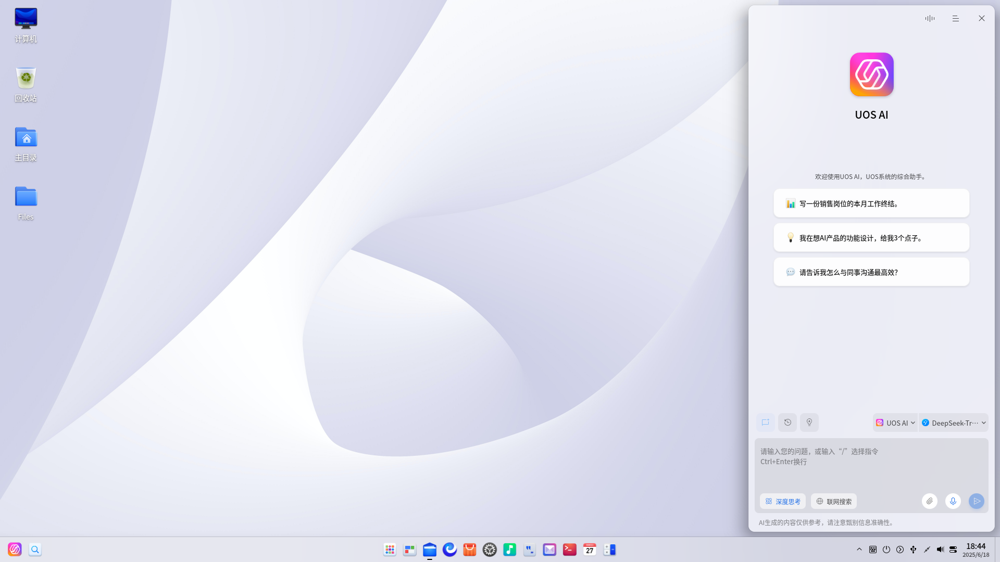
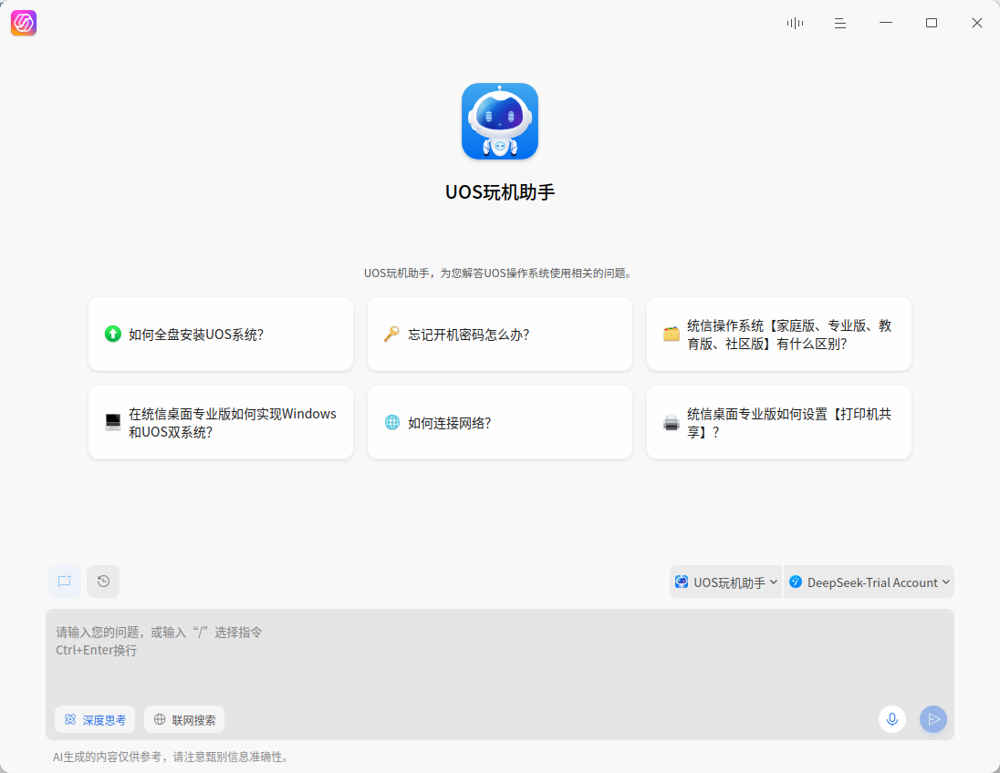
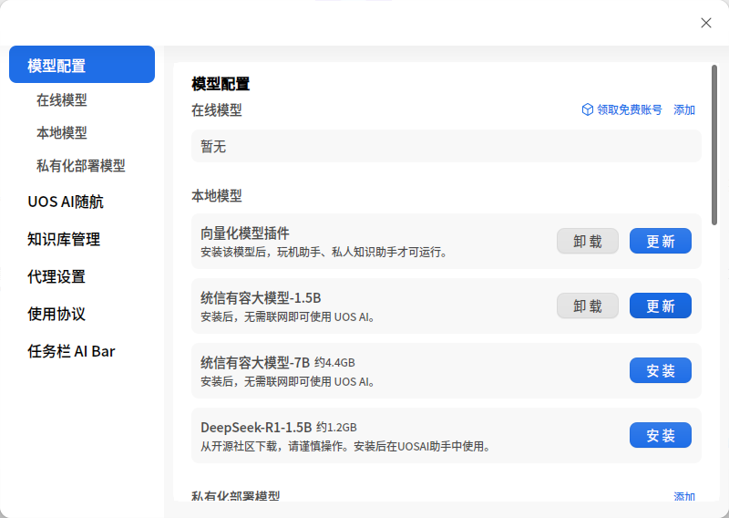
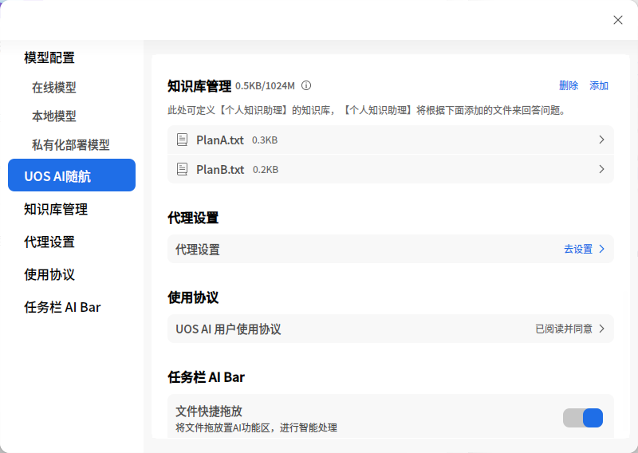

# UOS AI助手|uos-ai-assistant|

## 概述
UOS AI助手是一款综合性的助手，主要功能包含写作问答、文生图、自然语言控制、文档总结等，旨在为用于提供全方位的AI辅助能力，主要能力介绍如下：

**写作问答**

UOS AI助手能够根据用户的问题或指令，生成各种形式的内容，包括文本、图像等，并提供详尽的信息回答。
在办公环境中，您可以利用这项功能快速生成会议记录、报告草稿；在学习时，可以查询资料，获取知识点的详细解释等。

**自然语言交互**（系统控制）

此功能允许用户通过自然语言与助手进行交流，控制计算机系统或应用程序，执行如打开应用、调整系统参数、创建日程等操作。
简单地说出指令，如“提醒我下午3点参加会议”，助手会自动设置日程；也可以通过一句话完成系统设置，如：将屏幕亮度调到20%、切换壁纸等；也可以一句话打开应用，如：打开WPS，无需在应用列表中去寻找应用。

**个人知识库**

个人知识库可以允许用户添加自己资料给【个人知识助手】，添加后AI即可基于自己的知识来回答问题或写作。

**AI 随航**

您可以在统信UOS的任意界面（包含在绝大部分三方应用内），通过选中词语、段落，即可调起AI随航，使用AI随航的AI搜索、AI解释、AI总结、AI翻译以及续写、扩写、纠错、润色等功能。

## 快速上手

### 认识界面

UOS AI 助手支持两种模式的界面，可以根据您不同的需求场景，变换形态；切换方法是在顶部工具栏的【更多】子菜单中，找到【模式】选项，即可选择不同模式。

**窗口模式**

界面为横屏，且可随意移动和改变大小，适合沉浸式体验。

**侧边栏模式**

界面为竖屏，界面不可移动，固定在屏幕左侧，但可调节宽度，适合和其他应用共同使用场景，为其他应用提供AI辅助能力。

### 文本聊天模式

**语音输入**

语音输入功能使用户能够通过说话与AI助手进行交流，无需手动键入文字，具体使用步骤如下：
1. 激活语音输入：点击输入框旁边的麦克风图标，激活语音输入模式。
2. 开始说话：在激活语音输入后，您可以开始说话。UOS AI助手会实时听取并转录您的语音输入。
3. 发送文本：完成输入后，点击发送按钮，或者按下Enter键，将您的文本发送给AI助手。

**文本输入**

文本输入是传统的文字交流方式，用户可以在输入框中键入问题、系统操作指令，写作提示词等。
1. 点击输入框：将光标定位到输入框中。
2. 键入文本：输入您想要询问的问题或需要助手执行的指令。
3. 发送文本：完成输入后，点击发送按钮，或者按下Enter键，将您的文本发送给AI助手。

**输入框功能特点**

1. 多语言支持：UOS AI助手的文本输入，支持中文、英语等多种语言（取决于接入的大模型支持哪些语言），但语音输入只支持中文和英文。
2. 实时反馈：在语音输入时，输入框会显示动态图标，告知用户助手正在听取指令。
3. 支持文件：你可以将文件拖入输入框，将其发送给助手，助手可以总结文件内容，或者根据文件内容问答用户提问。
4. 换行输入：点击Ctrl+Enter组合键，可换行输入内容。
5. 聊天区域是UOS AI助手展示对话历史和交互反馈的地方。它不仅能呈现文字、图片回复，还集成了朗读、复制等增强功能。同时，支持清除当前的聊天记录。
6. 对于一个问题的回答，如果不满意当前的回答内容，也可以点击【重新生成】，以重新生成新的回答，并且可以点击答案切换按钮，来查看对比每次生成的答案。

### 语音对话模式

UOS AI助手的语音对话功能，允许用户直接通过语音与UOS AI助手进行交流，同时，AI助手也会用语音做出回应。该功能完全模拟真实的人与人对话的场景，交互自然友好。

用户可以向UOS AI提问，并继续用语音追问问题，让问问题就像和人讨论一样自然；用户也可以将UOS AI助手作为陪聊玩伴，为自己讲故事、聊天谈心、出谋划策等。

### 快速开始

在任务栏中，找到 UOS AI 应用图标；点击即可打开应用；
初次进入应用，会有弹窗提示领取免费账号；点击领取按钮，即可领取免费账号；
注意：赠送免费账号的活动可能会结束，具体活动时间以应用内表现为准。如果不使用免费账号，您也可以配置自己的大模型账号，以使用 UOS AI 助手
账号领取完成后，即可进入应用，选择 UOS AI 助手，即可开始聊天问答。（UOS AI 助手是默认选中）。

## 智能体

### UOS AI 助手
UOS AI 助手是一个综合助手，他能完成各种综合性任务，比如：
1. AI 问答：基于常识问题，直接解答；同时，选中官方免费的 Deepseek 模型，还可以联网搜索问答，已解决一些有时效性、大模型知识不包含的问题；
2. AI 写作：基于您给的提示，完成写作，比如：基于我本月的所有周报（可以通过文件方式提供），给我写一个月度工作总结
3. 系统控制：将屏幕亮度调整到 40%、打开 WPS 应用、创建日程。
4.  AI 生图：基于你的需求，为你生成图片，如：画一幅图：落霞与孤鹜齐飞。
注意：系统控制和 AI 生图，需要依赖特定的模型才可实现，且不支持本地模型。

### UOS 玩机助手

该助手内置了 UOS系统和相关应用的使用手册和问题解决方案，他可以帮助您解答 UOS系统和相关应用方面的知识。
他将成为您 7x24h 的客服，有任何 UOS 系统和应用相关的问题，您都可以咨询他。

### 个人知识助手

个人知识库助手是转为个人打造的知识管理和应用解决方案。该智能体允许您添加自己的知识到AI 的知识库，AI 回答问题是，会优先参考您的知识库回答问题、写作；这解决了 AI 不知道您私有知识的问题，让 AI 生成的内容，更符合您的工作环境。
在智能体列表中，选择个人知识助手，即可开始使用。
备注：在使用个人知识助手前，你需要先添加自己的文档到知识库，添加成功后，您便可以在【个人知识助手】智能体中，针对知识库提问，AI 生成的回答中，变回基于你的知识库回答。
具体的添加方法，详见下文的【设置】-【知识库设置】章节。

## 设置

### 模型接入

UOS AI 助手支持同时支持三种类型的模型，使用方式如下：

**在线模型**

启动应用后，领取免费账号，领取成功后，即可开始试用。
如果错过了初次启动时的免费账号弹窗，可以在设置中领取。
除了领取免费账号，您也可以配置您自己的在线模

同时你也可以添加自己的AI模型账号，以适应各种特定的使用场景。在【在线模型】栏点击【添加】入口，即可唤起【添加模型】弹窗，你可以根据需要，选择你所需的模型，填入APIKey等参数后，即可正常使用该模型。

当前官方适配的模型有百度千帆、讯飞星火、360智脑、智谱ChatGLM等；

如果你需要接入其他的模型，也可通过自定义模型接入。自定义模型支持所有OpenAI格式的API接口。

**本地模型**

打开设置，在中，先安装【向量化模型插件】，再安装【Deepseek】本地模型，安装成功后，在模型列表中，选择有容大模型即可。
注意，在安装和使用 Deepseek 模型前，必须要先安装【向量化模型插件】，否则本地模型将无法下载和使用

 

**私有化部署模型**

打开设置，在【私有化部署模型】板块，可以接入私有化部署模型，让 UOS AI 使用您自己的模型来回答问题或写作。
注意：当前只支持 OpenAI 格式的 API。

### 知识库管理

在使用知识库前，你需要先创建你的知识库，在【设置】【知识库管理】模块，你可以创建和管理你的知识库。
点击【添加】按钮，即可添加文件到知识库中，添加成功后，您便可以在【个人知识助手】智能体中，针对知识库提问，AI 生成的回答中，变回基于你的知识库回答。
点击【删除】按钮，即可逐条删除已添加的文档。

 

### 通用设置

在设置中，除了可设置模型、知识库管理之外，你还可以：
1. 开启或关闭随航功能，关闭随航后，在选中文本时，将不会再出现随航图标；
2. 设置应用的代理，以方便访问所有的模型；
3. 参看使用协议。

## 插件
### AI 随航

**唤醒方式**

在系统任意界面（包含在绝大部分三方应用内），选中文字，会出现UOS AI图标，鼠标悬浮在图标上0.5秒左右，会出现随航工具栏。点击非工具栏的任意位置，或按Esc，均会关闭随航工具栏。

**工具栏功能介绍**

| 功能名称 | 功能解释                                                     |
| -------- | ------------------------------------------------------------ |
| 图标     | 点击后，打开UOS AI助手面板。                                 |
| 搜索     | 在浏览器中打开AI搜索，深入解释选中词语。                     |
| 解释     | 清晰易懂的解释选中词语的意思。                               |
| 总结     | 简明扼要的将选中词语进行概要总结。                           |
| 翻译     | 将选中文本翻译成中/英文。                                    |
| 续写     | 基于选中词语的意思，继续向后撰写符合原意的文案。             |
| 扩写     | 基于选中词语的意思，前后发散，补充细节或描述，让内容更加丰富。 |
| 纠错     | 纠正选中词语中的错别字和措辞不当等问题。                     |
| 润色     | 可以根据选中的润色风格，对选中词语的文风和措辞进行调整和润色。 |
| 隐藏     | 隐藏随航功能，后续不再划词出现，但仍可前往UOS AI设置内重新打开，或使用快捷键Super+空格键唤醒。 |

**随航生成面板**

点击随航任意功能，均会打开随航的生成快捷面板并实时生成结果，在面板顶部，可切换使用随航其他功能。

若对生成结果很满意，可在任意输入框内，点击快捷面板的**粘贴至正文**功能，将生成结果粘贴至输入框内；或点击**复制**，将生成结果复制到剪贴板。

若对生成结果不满意，可点击**重新生成**，此时将重新生成回答内容。

若想对生成结果进一步调整，可点击**继续对话**或点击，将当前对话内容带入至UOS AI助手对话框，发送新的指令进行调整。

### AI 写作

**唤醒方式**

在系统大多数输入框中，处于输入状态时，使用快捷键**Super+空格键**，来唤醒AI写作。该面板可以通过点击x或按Esc关闭。

**功能介绍**

AI写作提供了包括写文章、写大纲、写通知在内等写作场景的7种提示词模板。

选择任一模板后，替换模板中的【蓝色关键词】，按下Enter或点击发送。

大模型根据提示词要求生成内容后：

若对生成结果很满意，可在任意输入框内，点击快捷面板的**粘贴至正文**功能，将生成结果粘贴至输入框内；或点击**复制**，将生成结果复制到剪贴板。

若对生成结果不满意，可点击**重新生成**，此时将重新生成回答内容。

若想对生成结果进一步调整，可点击顶部输入框“对已生成内容和修改、换个语气...”，发送新的指令进行调整。

## 版本差异说明

由于设备性能、系统版本等原因的差异，本地模型、个人知识库、在线模型等功能，可能在某些版本或设备上不支持。
建议使用最新的系统和UOS AI 应用更新到最新版本；并采用性能较好的设备，以便体验到最全的 AI 能力。
