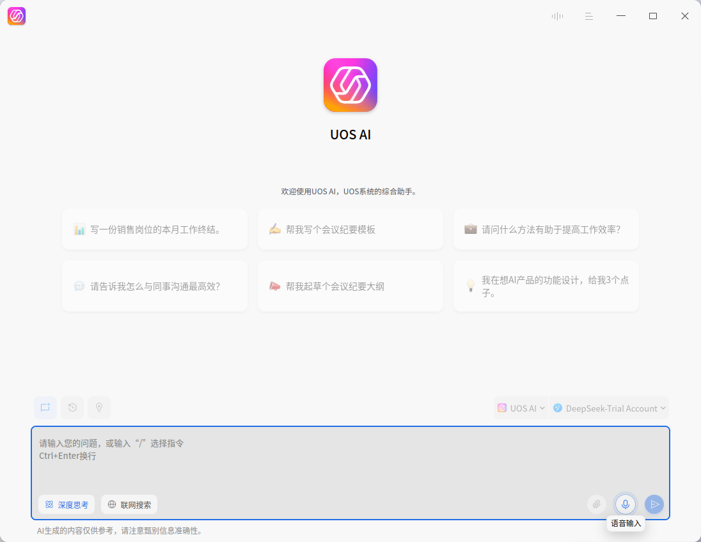
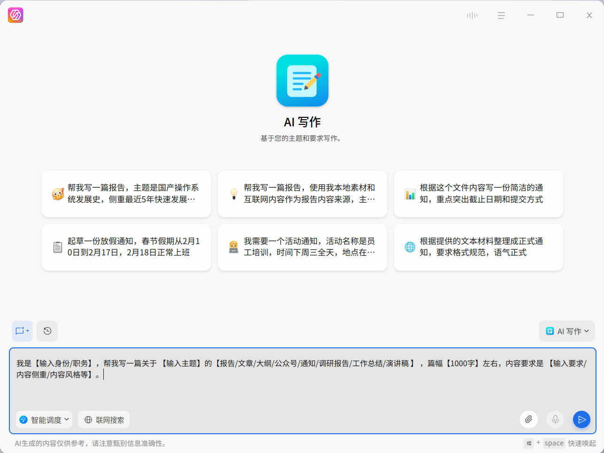
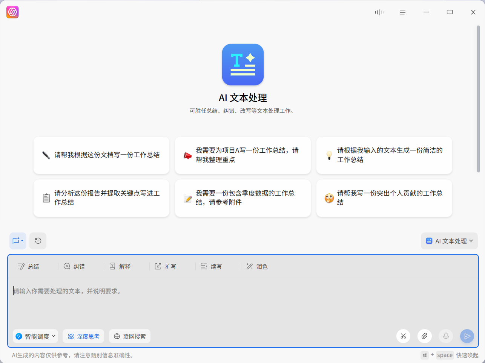
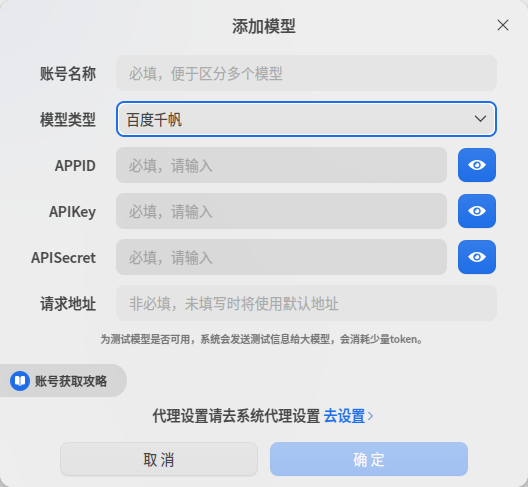
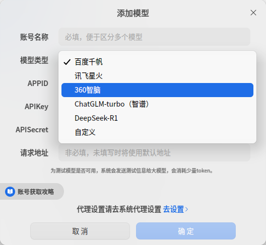
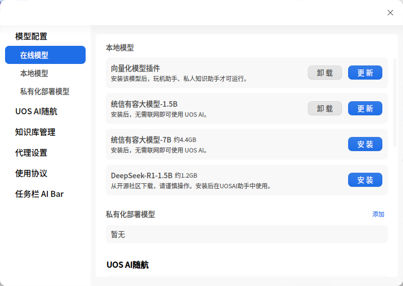
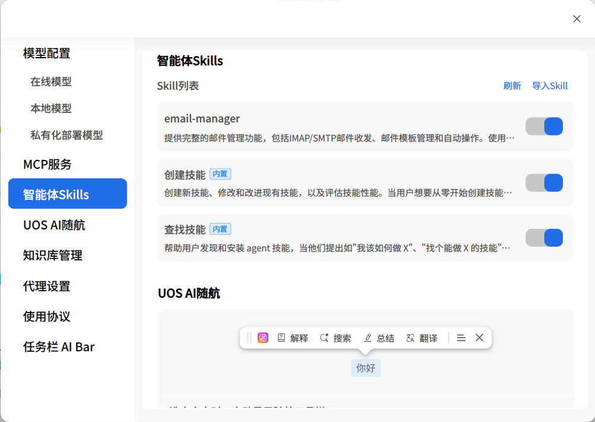
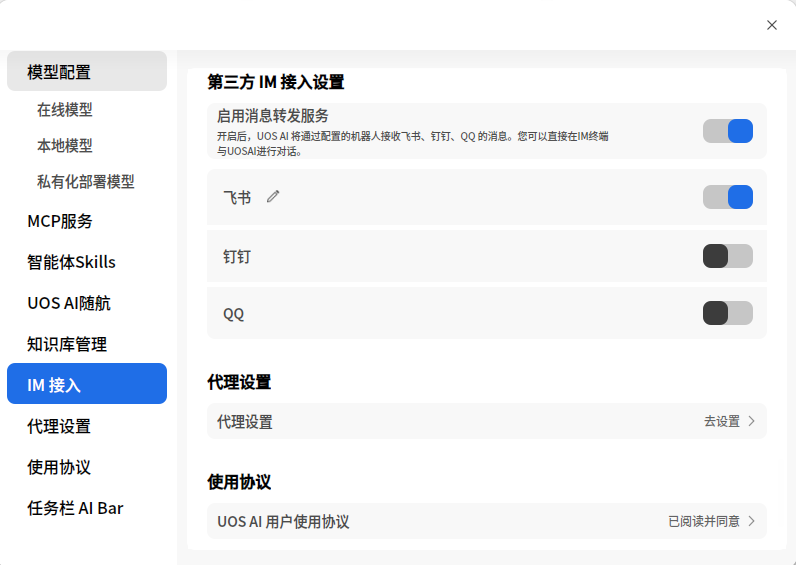
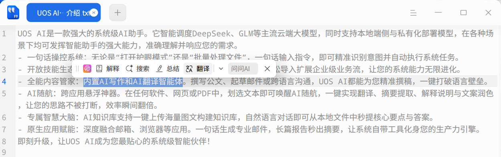
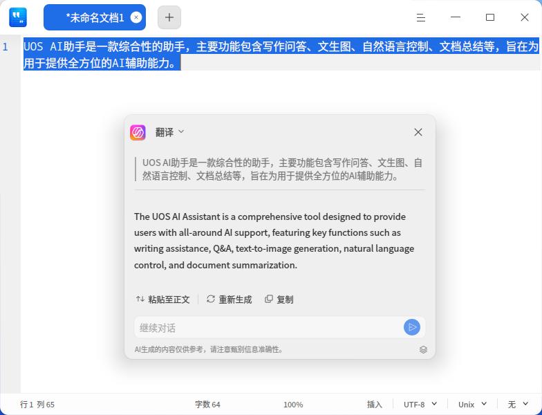

# UOS 人工智能幫手|uos-ai-assistant|

## 概述
UOS AI助手是一款綜合性嘅助手，主要功能包含寫作問答、文生圖、自然語言控制、文檔總結等，旨在為用家提供全方位嘅AI輔助能力，主要能力介紹如下：

**寫作問答**

UOS AI助手能夠根據用家嘅問題或指令，生成各種形式嘅內容，包括文本、圖像等，並提供詳盡嘅信息回答。  
喺辦公環境中，你可以利用呢項功能快速生成會議記錄、報告草稿；喺學習時，可以查詢資料，獲取知識點嘅詳細解釋等。

**自然語言交互**（系統控制）

此功能允許用家通過自然語言與助手進行交流，控制電腦系統或應用程式，執行如打開應用、調整系統參數、創建日程等操作。  
簡單咁講出指令，如“提醒我下午3點參加會議”，助手會自動設置日程；亦可以通過一句話完成系統設置，如：將屏幕亮度調到20%、切換壁紙等；亦可以一句話打開應用，如：打開WPS，無需喺應用列表中去尋找應用。

**個人知識庫**

個人知識庫允許用家添加自己嘅資料到知識庫，開啟知識庫功能後，AI 即可基於你嘅專屬知識來回答問題或寫作，讓生成嘅內容更符合你嘅真實工作環境。

**AI 隨航**

你可以喺系統嘅任意界面（包含喺絕大部分三方應用內），通過選中詞語、段落，即可調起AI隨航，使用AI隨航嘅AI搜索、AI解釋、AI總結、AI翻譯以及續寫、擴寫、糾錯、潤色等功能。

## 快速上手
### 認識界面

UOS AI 助手支持兩種模式嘅界面，可以根據你唔同嘅需求場景，變換形態；切換方法係喺頂部工具欄嘅【更多】子菜單中，找到【模式】選項，即可選擇唔同模式。使用 **Super + 空格鍵** 快速喚起窗口模式。

**窗口模式**

界面為橫屏，且可隨意移動和改變大小，適合沉浸式體驗。

**側邊欄模式**

界面為豎屏，界面不可移動，固定喺屏幕左側，但可調節寬度，適合和其他應用共同使用場景，為其他應用提供AI輔助能力。

### 文本聊天模式

**語音輸入**

語音輸入功能使用家能夠通過講話與AI助手進行交流，無需手動鍵入文字，具體使用步驟如下：  
1. 激活語音輸入：點擊輸入框旁邊嘅麥克風圖標，激活語音輸入模式。  
2. 開始講話：喺激活語音輸入後，你可以開始講話。UOS AI助手會實時聽取並轉錄你嘅語音輸入。  
3. 發送文本：完成輸入後，點擊發送按鈕，或者按下 **Enter** 鍵，將你嘅文本發送畀AI助手。

**文本輸入**

文本輸入係傳統嘅文字交流方式，用家可以喺輸入框中鍵入問題、系統操作指令，寫作提示詞等。  
1. 點擊輸入框：將光標定位到輸入框中。  
2. 鍵入文本：輸入你想要詢問嘅問題或需要助手執行嘅指令。  
3. 發送文本：完成輸入後，點擊發送按鈕，或者按下 **Enter** 鍵，將你嘅文本發送畀AI助手。

**輸入框功能特點**

1. 多語言支持：UOS AI助手嘅文本輸入，支持中文、英文等多種語言（取決於接入嘅大模型支持哪些語言），但語音輸入只支持中文和英文。  
2. 實時反饋：喺語音輸入時，輸入框會顯示動態圖標，告知用家助手正在聽取指令。  
3. 支持文件與圖片：你可以將最多 3 個文件或圖片（支持文檔、圖片、Markdown、常見代碼格式等）拖入、粘貼或上傳到輸入框發送畀助手，助手可提取內容進行總結或問答。
4. 截圖問答：點擊 **截圖問答** 入口或使用快捷鍵 **Ctrl + Alt + Q**，可直接調用系統截圖並發送畀助手進行問答。
4. 換行輸入：點擊 **Ctrl + Enter** 組合鍵，可換行輸入內容。  
5. 隱私對話：點擊 **新建對話** 圖標旁嘅下拉菜單，可選擇創建 **普通對話** 或 **隱私對話**。進入隱私對話後，聊天記錄將不會被保存，離開界面時內容會被完全刪除。
6. 歷史記錄：喺對話界面點擊 **歷史記錄** 圖標，可從底部向上展開歷史記錄面板，查看歷史記錄。懸浮喺會話上可點擊 **刪除** 圖標將其清理，單擊 **清除歷史記錄** 按鈕可以清空所有歷史記錄。
7. 聊天區域係UOS AI助手展示對話歷史和交互反饋嘅地方。佢唔單止能呈現文字、圖片回復，仲集成咗朗讀、複製等增強功能。同時，支持清除當前嘅聊天記錄。  
8. 消息二次編輯：喺你發出嘅每條消息下方，提供 **複製** 和 **重新編輯** 功能。點擊 **重新編輯** 可將該條消息包含嘅文本和文件重新帶入輸入框，方便調整指令。
9. 對於一個問題嘅回答，如果唔滿意當前嘅回答內容，亦可以點擊 **重新生成**，以重新生成新嘅回答，並且可以點擊答案切換按鈕，來查看對比每次生成嘅答案。

### 語音對話模式

UOS AI助手嘅語音對話功能，允許用家直接通過語音與UOS AI助手進行交流，同時，AI助手亦會用語音做出回應。該功能完全模擬真實嘅人與人對話嘅場景，交互自然友好。

用家可以向UOS AI提問，並繼續用語音追問問題，讓問問題就好似同人討論一樣自然；用家亦可以將UOS AI助手作為陪聊玩伴，為自己講故事、聊天談心、出謀劃策等。

### 快速開始

喺任務欄中，找到 UOS AI 應用圖標；點擊即可打開應用；  
初次進入應用，會有彈窗提示領取免費賬號；點擊領取按鈕，即可領取免費賬號；  
注意：贈送免費賬號嘅活動可能會結束，具體活動時間以應用內表現為準。如果唔使用免費賬號，你亦可以配置自己嘅大模型賬號，以使用 UOS AI 助手  
賬號領取完成後，即可進入應用，選擇 UOS AI 助手，即可開始聊天問答。（UOS AI 助手係默認選中）。

## 智能體
### UOS AI 助手
UOS AI 助手係一個綜合助手，佢能完成各種綜合性任務，比如：  
1. AI 問答：基於常識問題，直接解答；同時，選中官方免費嘅 “智能調度” 模型，仲可以聯網搜索問答，已解決一啲有時效性、大模型知識唔包含嘅問題；  
2. 指令：打開 **指令** 開關後，支持系統控制、開關應用、發送郵件、創建日程、多媒體控制等指令，例如：將屏幕亮度調整到 40%、打開 WPS 應用、創建一個日程。
3. 知識庫：打開 **知識庫** 開關後，助手將優先基於你個人知識庫中嘅內容來回答問題。
4. MCP&Skills：打開 **MCP&Skills** 開關，即可使用 MCP服務和Skills。只需一句話指令（如“把系統調整為深色模式”），即可自動調用相關系統設置、文件處理等自動化工具完成複雜任務。技能模塊內置咗創建技能和查找技能，你可以自由搜索和創建需要嘅技能（如“幫我創建一個週報skill”），一句話多步複雜工作。
5. AI 生圖：基於你嘅需求，為你生成圖片，如：畫一幅圖：落霞與孤鶩齊飛。  
注意：系統控制和 AI 生圖，需要依賴特定嘅模型先可實現，且唔支持本地模型。

### AI 寫作

AI 寫作智能體專為需要撰寫公文、報告或長篇文章嘅用家打造。佢允許你基於本地嘅參考素材和結構化大綱生成專業文檔，同時支持使用端側模型以保證資料嘅安全與隱私。

- **上傳素材與大綱**：喺對話框上方，點擊 **本地素材** 可最多上傳 10 個參考文件；點擊 **大綱文件** 可上傳 1 個大綱文件。系統將自動解析大綱，你仲可以喺界面上對大綱嘅章節進行增刪和拖拽排序。
- **基於大綱生成**：大綱確認無誤後，點擊 **基於大綱生成內容**，AI 將自動搜集素材並生成正文。
- **內置寫作編輯器**：內容生成後，點擊進入內置嘅寫作編輯器頁面。喺編輯器內，你可以進一步對文本進行加粗、修改標題層級、設置列表等格式操作。
- **導出文檔**：編輯完成後，點擊工具欄中嘅 **另存**，可將文檔保存為 Word、PDF 或 Markdown 格式到本地。

### AI 文本處理

AI 文本處理智能體專為處理各類文本任務而設計，可以勝任總結、糾錯、改寫等文本處理工作。

提供翻譯、總結、潤色等處理能力。點擊對應嘅功能標籤即可高亮選中，此時輸入框嘅內容不會被清空。如果唔選中任何標籤，系統將隨機為你提供提問提示。

喺輸入框中鍵入需要處理嘅內容和要求，按下 **Enter** 鍵即可發送畀助手處理。

### AI翻譯

AI翻譯智能體精通多語言翻譯。

喺輸入框中鍵入需要翻譯嘅內容，並說明翻譯語言，按下 **Enter** 鍵即可發送畀助手處理。默認翻譯為中文。

### 玩機助手

該助手內置咗 UOS系統和相關應用嘅使用手冊和問題解決方案，佢可以幫助你解答 UOS系統和相關應用方面嘅知識。  
佢將成為你 7x24h 嘅客服，有任何 UOS 系統和應用相關嘅問題，你都可以咨詢佢。

## 設置
### 模型接入

UOS AI 助手支持同時支持三種類型嘅模型，使用方式如下：

**在線模型**

啟動應用後，領取免費賬號，領取成功後，即可開始試用。  
如果錯過咗初次啟動時嘅免費賬號彈窗，可以在設置中領取。  
除咗領取免費賬號，你亦可以配置你自己嘅在線模型。

同時你亦可以添加自己嘅AI模型賬號，以適應各種特定嘅使用場景。喺【在線模型】欄點擊 **添加** 入口，即可喚起【添加模型】彈窗，你可以根據需要，選擇你所需嘅模型，填入APIKey等參數後，即可正常使用該模型。

當前官方適配嘅模型有百度千帆、訊飛星火、360智腦、智譜ChatGLM等；

如果你需要接入其他嘅模型，亦可通過自定義模型接入。自定義模型支持所有OpenAI格式嘅API接口。

**本地模型**

打開設置，喺中，先安裝 **向量化模型插件**，再安裝 **Deepseek** 本地模型，安裝成功後，喺模型列表中，選擇有容大模型即可。  
注意，喺安裝和使用 Deepseek 模型前，必須要先安裝 **向量化模型插件**，否則本地模型將無法下載和使用。

**私有化部署模型**

打開設置，喺 **私有化部署模型** 板塊，可以接入私有化部署模型，讓 UOS AI 使用你自己嘅模型來回答問題或寫作。  
注意：當前只支持 OpenAI 格式嘅 API。

### 知識庫管理

喺使用知識庫前，你需要先創建知識庫，喺【設置】嘅 **知識庫管理** 模塊中進行操作。
點擊 **添加** 按鈕，即可將文件添加到知識庫中，支持常見文檔、Markdown、圖片、代碼等格式。除咗喺設置中添加，你亦可以喺系統文件管理器或桌面上，右鍵點擊文件並選擇 **添加到AI知識庫**，或者喺隨航工具欄中點擊 **添加到AI知識庫** 快速錄入內容。
添加成功後，你便可以喺 UOS AI 助手嘅聊天框頂部打開 **知識庫** 開關，AI 將基於你嘅知識庫內容進行回答。
點擊 **刪除** 按鈕，即可逐條刪除已添加嘅文檔。

### MCP服務

如果你想使用更多MCP服務，可以喺【設置】中嘅 **MCP服務** 模塊管理和配置MCP工具：

1. **安裝環境**：首次使用需點擊安裝 UOS AI Agent 環境。
2. **管理服務**：列表中展示咗內置嘅系統 MCP 伺服器、三方精選 MCP 伺服器以及用家自定義添加嘅伺服器。你可以自由地開啟、停用、編輯或刪除自定義伺服器。
3. **添加伺服器**：點擊 **添加MCP服務**，將合法嘅 JSON 配置代碼粘貼到輸入框中，即可接入更多自動化控制工具。

> 注意：啟用三方 MCP 伺服器功能存在一定風險，使用內置工具自動下載依賴項可能會產生流量費用，請你悉知風險並謹慎操作。

### 智能體Skills

你可以喺 智能體Skills 模塊導入和管理skills

單擊 **導入Skill**，可以導入skill文件，支持導入.zip、.skill 壓縮包文件。

喺Skill列表中，你可以啟用、停用skills，亦可以刪除自定義skills。

### IM 接入

UOS AI 支持接入**飛書**、**QQ**、**釘釘**等主流 IM 工具，實現移動端與 PC 端跨端協同。

您可以在 **IM 接入** 模組，點擊 **啟用消息轉發服務** 及需要配置的 IM 工具，配置開啟功能。 詳細配置方法請關注官方發佈的配置教程。

### 通用設置

喺設置中，除咗可設置模型、知識庫管理之外，你仲可以：  
1. 開啟或關閉隨航功能，關閉隨航後，喺選中文本時，將唔會再出現隨航圖標；  
2. 設置應用嘅代理，以方便訪問所有嘅模型；  
3. 參看使用協議。

## 插件
### AI 隨航

**喚醒方式**

喺系統任意界面（包含喺絕大部分三方應用內），選中文字，會出現UOS AI圖標，鼠標懸浮喺圖標上0.5秒左右，會出現隨航工具欄。

你亦可以直接使用快捷鍵 **Super + R** 喚醒。

點擊非工具欄嘅任意位置，或按 **Esc**，均會關閉隨航工具欄。

**工具欄功能介紹**

| 功能名稱       | 功能解釋                                                     |
| -------------- | ------------------------------------------------------------ |
| 圖標           | 點擊後，打開UOS AI助手面板。                                 |
| 解釋           | 清晰易懂嘅解釋選中詞語嘅意思。                               |
| 搜索           | 喺瀏覽器中打開AI搜索，深入解釋選中詞語。                     |
| 總結           | 簡明扼要嘅將選中詞語進行概要總結。                           |
| 翻譯           | 將選中文本翻譯成中/英文。                                    |
| 問問AI         | 針對選中內容進行快捷提問。                                   |
| 添加到AI知識庫 | 將選中嘅內容快速保存到你嘅個人知識庫中，方便日後查詢。       |
| 續寫           | 基於選中詞語嘅意思，繼續向後撰寫符合原意嘅文案。             |
| 擴寫           | 基於選中詞語嘅意思，前後發散，補充細節或描述，讓內容更加豐富。 |
| 糾錯           | 糾正選中詞語中嘅錯別字和措辭不當等問題。                     |
| 潤色           | 可以根據選中嘅潤色風格，對選中詞語嘅文風和措辭進行調整和潤色。 |
| 隱藏           | 隱藏隨航功能，後續唔再劃詞出現，但仍可前往UOS AI設置內重新打開，或使用快捷鍵 **Super + R** 喚醒。 |

**隨航生成面板**

點擊隨航任意功能，均會打開隨航嘅生成快捷面板並實時生成結果，喺面板頂部，可切換使用隨航其他功能。

若對生成結果好滿意，可喺任意輸入框內，點擊快捷面板嘅 **粘貼至正文** 功能，將生成結果粘貼至輸入框內；或點擊 **複製**，將生成結果複製到剪貼板。

若對生成結果唔滿意，可點擊 **重新生成**，此時將重新生成回答內容。

若想對生成結果進一步調整，可點擊 **繼續對話** 或點擊，將當前對話內容帶入至UOS AI助手對話框，發送新嘅指令進行調整。

### AI 寫作

**喚醒方式**

喺系統大多數輸入框中，處於輸入狀態時，使用快捷鍵 **Super + 空格鍵**，來喚醒AI寫作。該面板可以通過點擊x或按 **Esc** 關閉。

**功能介紹**

AI寫作提供咗包括寫文章、寫大綱、寫通知在內等寫作場景嘅7種提示詞模板。

選擇任一模板後，替換模板中嘅【藍色關鍵詞】，按下 **Enter** 或點擊發送。

大模型根據提示詞要求生成內容後：

若對生成結果好滿意，可喺任意輸入框內，點擊快捷面板嘅 **粘貼至正文** 功能，將生成結果粘貼至輸入框內；或點擊 **複製**，將生成結果複製到剪貼板。

若對生成結果唔滿意，可點擊 **重新生成**，此時將重新生成回答內容。

若想對生成結果進一步調整，可點擊頂部輸入框“對已生成內容和修改、換個語氣...”，發送新嘅指令進行調整。

## 版本差異說明

由於設備性能、系統版本等原因嘅差異，本地模型、個人知識庫、在線模型等功能，可能喺某啲版本或設備上唔支援。  
建議使用最新嘅系統並將 UOS AI 應用更新至最新版本；同時採用性能較好嘅設備，以便體驗最全面嘅 AI 能力。