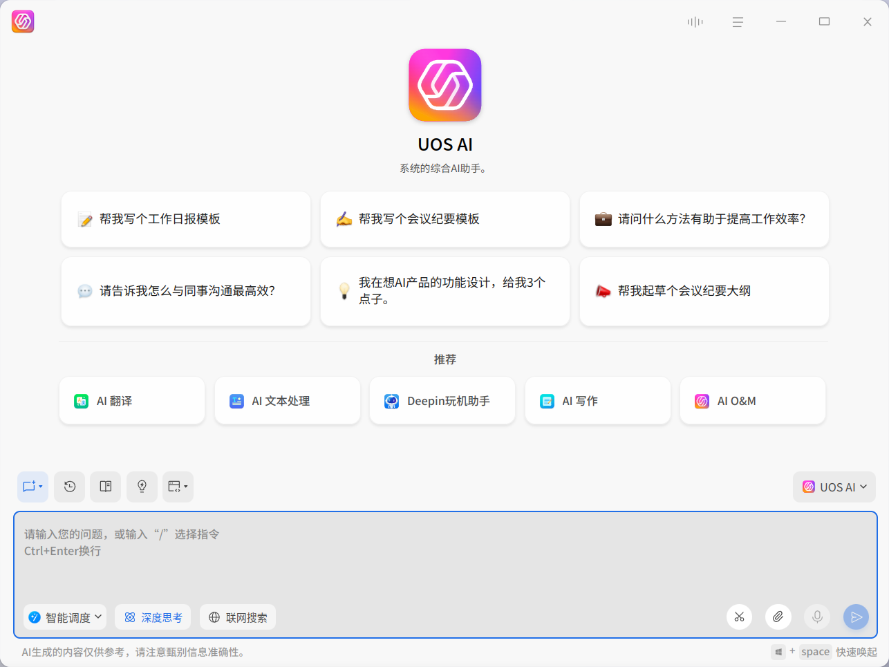
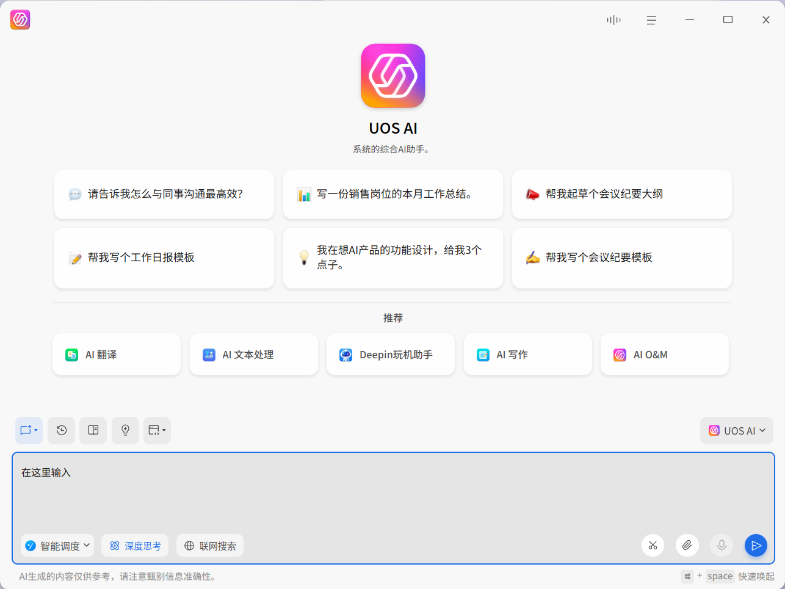
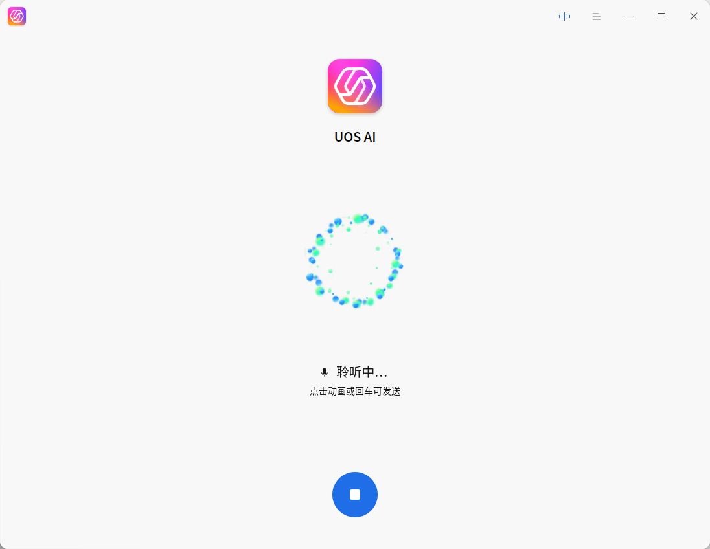
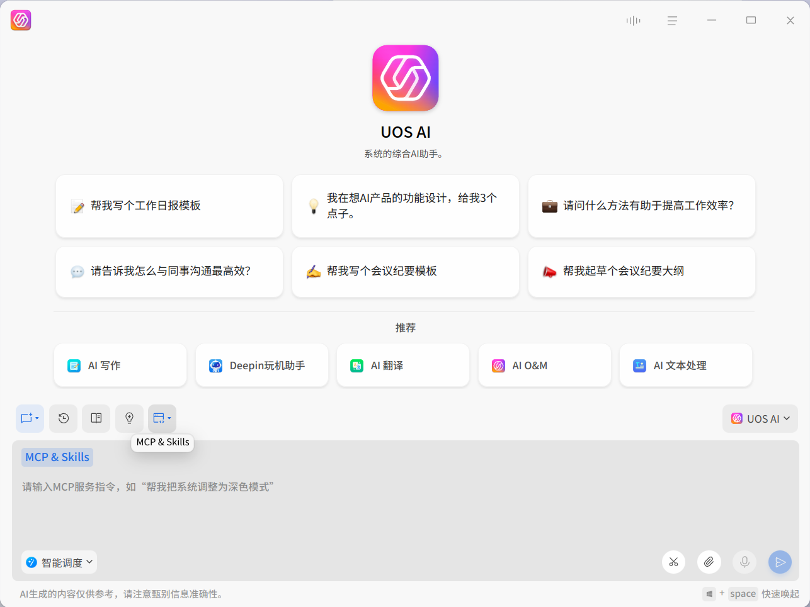
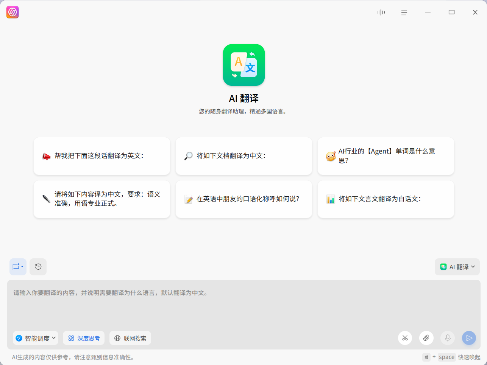
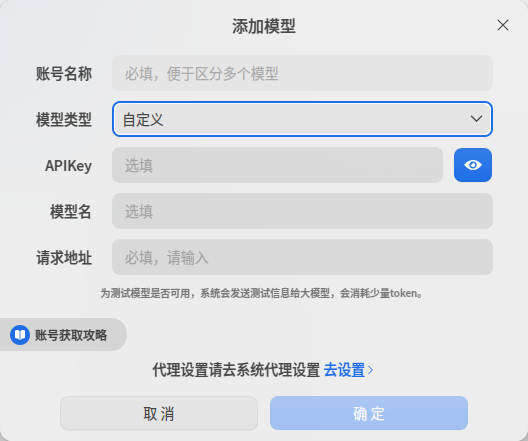
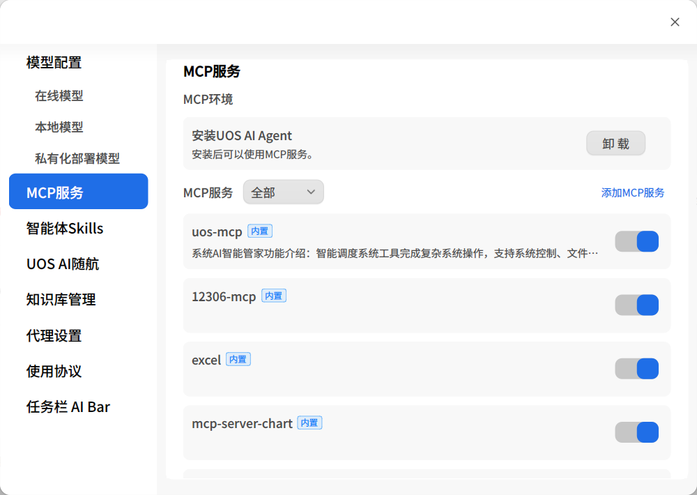
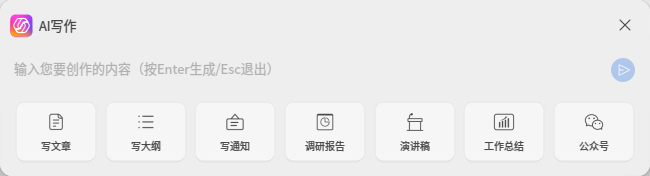
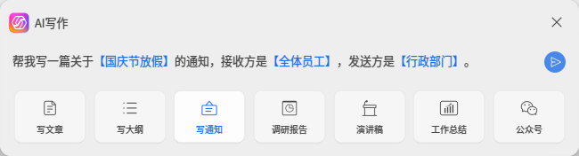
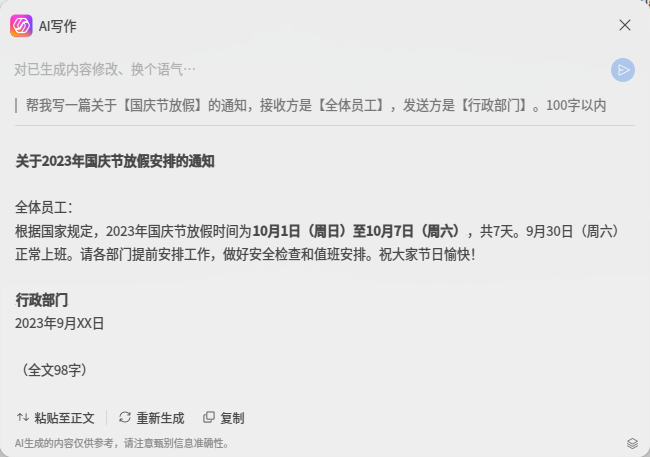

# UOS 人工智能助理|uos-ai-assistant|

## 概述
UOS AI助手是一款綜合性的助手，主要功能包含寫作問答、文生圖、自然語言控制、文件總結等，旨在為使用者提供全方位的AI輔助能力，主要能力介紹如下：

**寫作問答**

UOS AI助手能夠根據使用者的問題或指令，生成各種形式的內容，包括文字、圖像等，並提供詳盡的資訊回答。  
在辦公環境中，您可以利用這項功能快速生成會議記錄、報告草稿；在學習時，可以查詢資料，獲取知識點的詳細解釋等。

**自然語言交互**（系統控制）

此功能允許使用者通過自然語言與助手進行交流，控制電腦系統或應用程式，執行如開啟應用、調整系統參數、建立行程等操作。  
簡單說出指令，如「提醒我下午3點參加會議」，助手會自動設定行程；也可以通過一句話完成系統設定，如：將螢幕亮度調到20%、切換桌布等；也可以一句話開啟應用，如：開啟WPS，無需在應用列表中尋找應用。

**個人知識庫**

個人知識庫允許使用者添加自己的資料到知識庫，開啟知識庫功能後，AI 即可基於您的專屬知識來回答問題或寫作，讓生成的內容更符合您的真實工作環境。

**AI 隨航**

您可以在系統的任意介面（包含在絕大部分第三方應用內），通過選中詞語、段落，即可調起AI隨航，使用AI隨航的AI搜尋、AI解釋、AI總結、AI翻譯以及續寫、擴寫、糾錯、潤色等功能。

## 快速上手
### 認識介面

UOS AI 助手支援兩種模式的介面，可以根據您不同的需求場景，變換形態；切換方法是在頂部工具列的【更多】子選單中，找到【模式】選項，即可選擇不同模式。使用 **Super + 空格鍵** 快速喚起視窗模式。

**視窗模式**

介面為橫屏，且可隨意移動和改變大小，適合沉浸式體驗。

**側邊欄模式**

介面為豎屏，介面不可移動，固定在螢幕左側，但可調整寬度，適合和其他應用共同使用場景，為其他應用提供AI輔助能力。

### 文字聊天模式

**語音輸入**

語音輸入功能讓使用者能夠通過說話與AI助手進行交流，無需手動輸入文字，具體使用步驟如下：  
1. 啟用語音輸入：點擊輸入框旁的麥克風圖示，啟用語音輸入模式。  
2. 開始說話：在啟用語音輸入後，您可以開始說話。UOS AI助手會即時聽取並轉錄您的語音輸入。  
3. 發送文字：完成輸入後，點擊發送按鈕，或按下 **Enter** 鍵，將您的文字發送給AI助手。

**文字輸入**

文字輸入是傳統的文字交流方式，使用者可以在輸入框中鍵入問題、系統操作指令，寫作提示詞等。  
1. 點擊輸入框：將游標定位到輸入框中。  
2. 鍵入文字：輸入您想要詢問的問題或需要助手執行的指令。  
3. 發送文字：完成輸入後，點擊發送按鈕，或按下 **Enter** 鍵，將您的文字發送給AI助手。

**輸入框功能特點**

1. 多語言支援：UOS AI助手的文字輸入，支援中文、英文等多種語言（取決於接入的大模型支援哪些語言），但語音輸入只支援中文和英文。  
2. 即時回饋：在語音輸入時，輸入框會顯示動態圖示，告知使用者助手正在聽取指令。  
3. 支援文件與圖片：您可以將最多 3 個文件或圖片（支援文件、圖片、Markdown、常見程式碼格式等）拖入、貼上或上傳到輸入框發送給助手，助手可提取內容進行總結或問答。
4. 截圖問答：點擊 **截圖問答** 入口或使用快捷鍵 **Ctrl + Alt + Q**，可直接呼叫系統截圖並發送給助手進行問答。
5. 換行輸入：點擊 **Ctrl + Enter** 組合鍵，可換行輸入內容。  
6. 隱私對話：點擊 **新建對話** 圖示旁的下拉選單，可選擇建立 **普通對話** 或 **隱私對話**。進入隱私對話後，聊天記錄將不會被保存，離開介面時內容會被完全刪除。
7. 歷史記錄：在對話介面點擊 **歷史記錄** 圖示，可從底部向上展開歷史記錄面板，查看歷史記錄。懸停在對話上可點擊 **刪除** 圖示將其清理，點擊 **清除歷史記錄** 按鈕可以清空所有歷史記錄。
8. 聊天區域是UOS AI助手展示對話歷史和互動回饋的地方。它不僅能呈現文字、圖片回覆，還整合了朗讀、複製等增強功能。同時，支援清除當前的聊天記錄。  
9. 訊息二次編輯：在您發出的每條訊息下方，提供 **複製** 和 **重新編輯** 功能。點擊 **重新編輯** 可將該條訊息包含的文字和文件重新帶入輸入框，方便調整指令。
10. 對於一個問題的回答，如果不滿意當前的回答內容，也可以點擊 **重新生成**，以重新生成新的回答，並且可以點擊答案切換按鈕，來查看對比每次生成的答案。

### 語音對話模式

UOS AI助手的語音對話功能，允許使用者直接通過語音與UOS AI助手進行交流，同時，AI助手也會用語音做出回應。該功能完全模擬真實的人與人對話的場景，互動自然友好。

使用者可以向UOS AI提問，並繼續用語音追問問題，讓問問題就像和人討論一樣自然；使用者也可以將UOS AI助手作為陪聊玩伴，為自己講故事、聊天談心、出謀劃策等。

### 快速開始

在任務列中，找到 UOS AI 應用圖示；點擊即可開啟應用；  
初次進入應用，會有彈窗提示領取免費帳號；點擊領取按鈕，即可領取免費帳號；  
注意：贈送免費帳號的活動可能會結束，具體活動時間以應用內表現為準。如果不使用免費帳號，您也可以配置自己的大模型帳號，以使用 UOS AI 助手  
帳號領取完成後，即可進入應用，選擇 UOS AI 助手，即可開始聊天問答。（UOS AI 助手是預設選中）。

## 智能體

### UOS AI 助手

UOS AI 助手是一個綜合助手，他能完成各種綜合性任務，比如：  
1. AI 問答：基於常識問題，直接解答；同時，選中官方免費的「智能調度」模型，還可以聯網搜尋問答，已解決一些有時效性、大模型知識不包含的問題；  
2. 指令：開啟 **指令** 開關後，支援系統控制、開關應用、發送郵件、建立行程、多媒體控制等指令，例如：將螢幕亮度調整到 40%、開啟 WPS 應用、建立一個行程。
3. 知識庫：開啟 **知識庫** 開關後，助手將優先基於您個人知識庫中的內容來回答問題。
4. MCP&Skills：開啟 **MCP&Skills** 開關，即可使用 MCP服務和Skills。只需一句話指令（如「把系統調整為深色模式」），即可自動呼叫相關系統設定、文件處理等自動化工具完成複雜任務。技能模組內建了建立技能和尋找技能，您可以自由搜尋和建立需要的技能（如「幫我建立一個週報skill」），一句話多步複雜工作。
5. AI 生圖：基於您的需求，為您生成圖片，如：畫一幅圖：落霞與孤鶩齊飛。  
注意：系統控制和 AI 生圖，需要依賴特定的模型才可實現，且不支援本地模型。

### AI 寫作

AI 寫作智能體專為需要撰寫公文、報告或長篇文章的使用者打造。它允許您基於本地的參考素材和結構化大綱生成專業文件，同時支援使用端側模型以保證資料的安全與隱私。

- **上傳素材與大綱**：在對話框上方，點擊 **本地素材** 可最多上傳 10 個參考文件；點擊 **大綱文件** 可上傳 1 個大綱文件。系統將自動解析大綱，您還可以在介面上對大綱的章節進行增刪和拖曳排序。
- **基於大綱生成**：大綱確認無誤後，點擊 **基於大綱生成內容**，AI 將自動搜集素材並生成正文。
- **內建寫作編輯器**：內容生成後，點擊進入內建的寫作編輯器頁面。在編輯器內，您可以進一步對文字進行加粗、修改標題層級、設定列表等格式操作。
- **匯出文件**：編輯完成後，點擊工具列中的 **另存**，可將文件儲存為 Word、PDF 或 Markdown 格式到本地。

### AI 文本處理

AI 文本處理智能體專為處理各類文本任務而設計，可以勝任總結、糾錯、改寫等文本處理工作。

提供翻譯、總結、潤色等處理能力。點擊對應的功能標籤即可高亮選中，此時輸入框的內容不會被清空。如果不選中任何標籤，系統將隨機為您提供提問提示。

在輸入框中鍵入需要處理的內容和要求，按下 **Enter** 鍵即可發送給助手處理。

### AI翻譯

AI翻譯智能體精通多語言翻譯。

在輸入框中鍵入需要翻譯的內容，並說明翻譯語言，按下 **Enter** 鍵即可發送給助手處理。預設翻譯為中文。

### 玩機助手

該助手內建了 UOS系統和相關應用的使用手冊和問題解決方案，他可以幫助您解答 UOS系統和相關應用方面的知識。  
他將成為您 7x24h 的客服，有任何 UOS 系統和應用相關的問題，您都可以諮詢他。

## 設定

### 模型接入

UOS AI 助手支援同時支援三種類型的模型，使用方式如下：

**線上模型**

啟動應用後，領取免費帳號，領取成功後，即可開始試用。  
如果錯過了初次啟動時的免費帳號彈窗，可以在設定中領取。  
除了領取免費帳號，您也可以配置您自己的線上模型。

同時您也可以添加自己的AI模型帳號，以適應各種特定的使用場景。在【線上模型】欄點擊 **添加** 入口，即可喚起【添加模型】彈窗，您可以根據需要，選擇您所需的模型，填入APIKey等參數後，即可正常使用該模型。

當前官方適配的模型有百度千帆、訊飛星火、360智腦、智譜ChatGLM等；

如果您需要接入其他的模型，也可通過自定義模型接入。自定義模型支援所有OpenAI格式的API接口。

**本地模型**

開啟設定，在中，先安裝 **向量化模型插件**，再安裝 **Deepseek** 本地模型，安裝成功後，在模型列表中，選擇有容大模型即可。  
注意，在安裝和使用 Deepseek 模型前，必須要先安裝 **向量化模型插件**，否則本地模型將無法下載和使用。

**私有化部署模型**

開啟設定，在 **私有化部署模型** 板塊，可以接入私有化部署模型，讓 UOS AI 使用您自己的模型來回答問題或寫作。  
注意：當前只支援 OpenAI 格式的 API。

### 知識庫管理

在使用知識庫前，您需要先建立知識庫，在【設定】的 **知識庫管理** 模組中進行操作。
點擊 **添加** 按鈕，即可將文件添加到知識庫中，支援常見文件、Markdown、圖片、程式碼等格式。除了在設定中添加，您也可以在系統文件管理器或桌面上，右鍵點擊文件並選擇 **添加到AI知識庫**，或者在隨航工具列中點擊 **添加到AI知識庫** 快速輸入內容。
添加成功後，您便可以在 UOS AI 助手的聊天框頂部開啟 **知識庫** 開關，AI 將基於您的知識庫內容進行回答。
點擊 **刪除** 按鈕，即可逐條刪除已添加的文件。

### MCP服務

如果您想使用更多MCP服務，可以在【設定】中的 **MCP服務** 模組管理和配置MCP工具：

1. **安裝環境**：首次使用需點擊安裝 UOS AI Agent 環境。
2. **管理服務**：列表中展示了內建的系統 MCP 伺服器、第三方精選 MCP 伺服器以及使用者自定義添加的伺服器。您可以自由地開啟、停用、編輯或刪除自定義伺服器。
3. **添加伺服器**：點擊 **添加MCP服務**，將合法的 JSON 配置程式碼貼上到輸入框中，即可接入更多自動化控制工具。

> 注意：啟用第三方 MCP 伺服器功能存在一定風險，使用內建工具自動下載依賴項可能會產生流量費用，請您悉知風險並謹慎操作。

### 智能體Skills

您可以在 智能體Skills 模組匯入和管理skills

點擊 **匯入Skill** ，可以匯入skill文件，支援匯入.zip、.skill 壓縮包文件。

在Skill列表中，您可以啟用、停用skills，也可以刪除自定義skills。

### IM 接入

UOS AI 支援接入**飛書**、**QQ**、**釘釘**等主流 IM 工具，實現行動端與 PC 端跨端協同。

您可以在 **IM 接入** 模組，按一下 **啟用訊息轉發服務** 及需要配置的 IM 工具，配置開啟功能。詳細配置方法請關注官方發佈的配置教學。

### 通用設定

在設定中，除了可設定模型、知識庫管理之外，您還可以：  
1. 開啟或關閉隨航功能，關閉隨航後，在選中文字時，將不會再出現隨航圖示；  
2. 設定應用的代理，以方便存取所有的模型；  
3. 參看使用協議。

## 插件
### AI 隨航

**喚醒方式**

在系統任意介面（包含在絕大部分第三方應用內），選中文字，會出現UOS AI圖示，滑鼠懸停在圖示上0.5秒左右，會出現隨航工具列。

您也可以直接使用快捷鍵 **Super + R** 喚醒。

點擊非工具列的任意位置，或按 **Esc**，均會關閉隨航工具列。

**工具列功能介紹**

| 功能名稱       | 功能解釋                                                     |
| -------------- | ------------------------------------------------------------ |
| 圖示           | 點擊後，開啟UOS AI助手面板。                                 |
| 解釋           | 清晰易懂的解釋選中詞語的意思。                               |
| 搜尋           | 在瀏覽器中開啟AI搜尋，深入解釋選中詞語。                     |
| 總結           | 簡明扼要的將選中詞語進行概要總結。                           |
| 翻譯           | 將選中文字翻譯成中/英文。                                    |
| 問問AI         | 針對選中內容進行快捷提問。                                   |
| 添加到AI知識庫 | 將選中的內容快速保存到您的個人知識庫中，方便日後查詢。       |
| 續寫           | 基於選中詞語的意思，繼續向後撰寫符合原意的文案。             |
| 擴寫           | 基於選中詞語的意思，前後發散，補充細節或描述，讓內容更加豐富。 |
| 糾錯           | 糾正選中詞語中的錯別字和措辭不當等問題。                     |
| 潤色           | 可以根據選中的潤色風格，對選中詞語的文風和措辭進行調整和潤色。 |
| 隱藏           | 隱藏隨航功能，後續不再劃詞出現，但仍可前往UOS AI設定內重新開啟，或使用快捷鍵 **Super + R** 喚醒。 |

**隨航生成面板**

點擊隨航任意功能，均會開啟隨航的生成快捷面板並即時生成結果，在面板頂部，可切換使用隨航其他功能。

若對生成結果很滿意，可在任意輸入框內，點擊快捷面板的 **貼上至正文** 功能，將生成結果貼上至輸入框內；或點擊 **複製**，將生成結果複製到剪貼簿。

若對生成結果不滿意，可點擊 **重新生成**，此時將重新生成回答內容。

若想對生成結果進一步調整，可點擊 **繼續對話** 或點擊，將當前對話內容帶入至UOS AI助手對話框，發送新的指令進行調整。

### AI 寫作

**喚醒方式**

在系統大多數輸入框中，處於輸入狀態時，使用快捷鍵 **Super + 空格鍵**，來喚醒AI寫作。該面板可以通過點擊x或按 **Esc** 關閉。

**功能介紹**

AI寫作提供了包括寫文章、寫大綱、寫通知在內等寫作場景的7種提示詞模板。

選擇任一模板後，替換模板中的【藍色關鍵詞】，按下 **Enter** 或點擊發送。

大模型根據提示詞要求生成內容後：

若對生成結果很滿意，可在任意輸入框內，點擊快捷面板的 **貼上至正文** 功能，將生成結果貼上至輸入框內；或點擊 **複製**，將生成結果複製到剪貼簿。

若對生成結果不滿意，可點擊 **重新生成**，此時將重新生成回答內容。

若想對生成結果進一步調整，可點擊頂部輸入框“對已生成內容和修改、換個語氣...”，發送新的指令進行調整。

## 版本差異說明

由於設備性能、系統版本等差異，本地模型、個人知識庫、線上模型等功能，可能於某些版本或設備上不支援。  
建議使用最新的系統並將 UOS AI 應用更新至最新版本；同時採用性能較佳的設備，以便體驗最完整的 AI 能力。